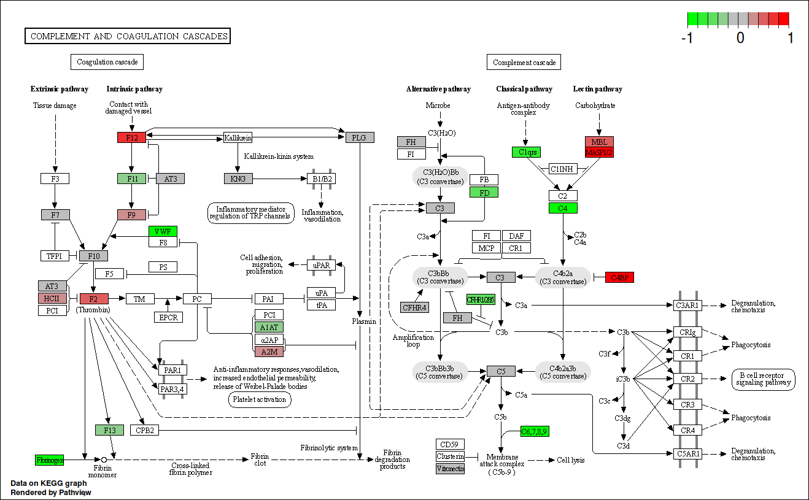

```{r setup, include=FALSE}
knitr::opts_chunk$set(echo = FALSE, warning = FALSE, message = FALSE) #sets these options for whole document
#options(knitr.kable.NA = '') #sets NAs in tables to be blank
#options(digits = 4) #sets rounding for the document

# below fixes kable tables in word output
# options(kableExtra.auto_format = FALSE)
## keep aux file
## options(tinytex.clean = FALSE)
```

```{r load-packages, include=FALSE}
## create vector of packages used
pkg <- c("kableExtra", "tidyverse", "captioner", "bibtex",
         "Hmisc", "psych", "naniar", "data.table", "rmarkdown",
         "knitr", "BiocManager", "purrr", "base", "readxl", "cowplot",
         "patchwork", "lubridate", "DiagrammeR", "ggVennDiagram",
         "RColorBrewer", "lime", "bookdown", "stringr", "rlang")

pkg_bioconductor <- c("ReactomePA", "STRINGdb", "MSstats")

## create function to installing any missing packages and then load them all
sort_packages <- function(packages, bioconductor = FALSE) {
    ## Check if packages are not installed and assign the
    ## names of the packages not installed to the variable new.pkg
    new_pkg <- packages[!(packages %in% installed.packages())]
    ## If the packages are bioconductor, install via biocmanager
    ## If there are any packages in the list that aren't installed,
    ## install them
    if (length(new_pkg) & !bioconductor) {
        install.packages(new_pkg, repos = "https://cran.rstudio.com")
    } else if (length(new_pkg) & bioconductor) {
        BiocManager::install(new_pkg)
    }
    ## load packages
    lapply(packages, require, character.only = TRUE)
}
## use function
sort_packages(pkg)
sort_packages(pkg_bioconductor, bioconductor = TRUE)
```

```{r, label='add-packages-to-bib'}
## get the packages version
packages_versions <- function(p) {
    paste(packageDescription(p)$Package, packageDescription(p)$Version, sep = " ")
}
## Get the packages references
write.bib(c(pkg, pkg_bioconductor), "extras/packages.bib")
## merge the zotero references and the packages references
cat(paste("% Automatically generated", Sys.time()), "\n% DO NOT EDIT",
{ readLines("extras/paper.bib") %>%
      paste(collapse = "\n") },
{ readLines("extras/packages.bib") %>%
      paste(collapse = "\n") },
file = "extras/paper_and_pkgs.bib",
    sep = "\n")
## Some packages reference keys must be modified
## (their key is not the package name)
## check in packages.bib
packages_keys <- c(pkg, pkg_bioconductor) %>%
  enframe() %>%
  mutate(value = case_when(value == "knitr" ~ "@knitr1",
                           #value == "boot" ~ "@boot1",
                           TRUE ~ paste0("@", value)))
```

```{r ggplot-theme3}
custom_theme <- function() {
theme_bw() +
theme(
axis.text = element_text(size = 8),
## axis.text.x = element_text(angle = 45, vjust = 1, hjust = 1),
axis.title = element_text(size = 8),
panel.grid.major = element_blank(),
panel.grid.minor = element_blank(),
panel.background = element_rect(fill = '#ffffff'),
strip.background = element_rect(fill = 'gray', color = 'black', size = 0.5),
strip.text = element_text(face = 'bold', size = 8, color = 'white'),
legend.position = 'right',
legend.justification = 'center',
legend.background = element_blank(),
panel.border = element_rect(color = 'grey5', fill = NA, size = 0.5))
#scale_fill_manual(values = c("tomato", "steelblue"))) # if there's a issue with the graphs remove this line
}

theme_set(custom_theme())
```

# Abstract

Introduction 

Spinal Cord Injury (SCI) is a major cause of disability, with complications post-injury often leading to life-long health issues with need of extensive treatment. Neurological outcome post-SCI can be variable and difficult to predict, particularly in incomplete injured patients. The identification of specific SCI biomarkers in blood, may be able to improve prognostics in the field. This study has utilised proteomic and bioinformatics methodologies to investigate differentially expressed proteins in plasma samples across human SCI cohorts with the aim of identifying prognostic biomarkers and biological pathway alterations that relate to neurological outcome.

Methods and Materials 

Blood samples were taken, following informed consent, from ASIA impairment scale (AIS) grade C "Improvers" (AIS grade improvement) and "Non-Improvers" (No AIS change), and AIS grade A and D at <2 weeks ("Acute") and approx. 3 months ("Sub-acute") post-injury. The total protein concentration from each sample was extracted, with pooled samples being labelled and non-pooled samples treated with ProteoMiner&trade; beads. Samples were then analysed using two 4-plex isobaric tag for relative and absolute quantification (iTRAQ) analyses and a label-free experiment for comparison, before quantifying with mass spectrometry. Proteomic datasets were analysed using **bioinformatics…** 

<!-- Karinas note: In brief description needed here -->

Proteins of interest identified from this analysis were further validated by enzyme-linked immunosorbent assay (ELISA).
OpenMS (version 2.6.0) was used to process the raw spectra data. 
R (version 4.1.4) and in particular, the R packages MSstats (version 4.0.1), STRINGdb (version 2.4.2) and pathview (version 1.32.0) were used for downstream analysis.

<!-- Need to add citations for R packages, though probably not in abstract -->

Results

The data demonstrated proteomic differences between the cohorts, with the results from the iTRAQ approach supporting those of the label-free analysis. A total of 79 and 87 differentially abundant proteins across AIS and longitudinal groups were identified from the iTRAQ and label-free analyses, respectively. Alpha-2-macroglobulin (A2M), retinol binding protein 4 (RBP4), serum amyloid A1 (SAA1), Peroxiredoxin 2, alipoprotein A1 (ApoA1) and several immunoglobulins were identified as biologically relevant and differentially abundant, with potential as individual prognostic biomarkers of neurological outcome. Bioinformatics analyses revealed that the majority of differentially abundant proteins were components of the complement cascade and most interacted directly with the liver.

Conclusions

Many of the proteins of interest identified using proteomics were detected only in a single group and therefore have potential as a binary (present or absent) biomarkers. Additional investigations into the chronology of these proteins, and their levels in other tissues (cerebrospinal fluid in particular) are needed to better understand the underlying pathophysiology, including any potentially modifiable targets. **The complement cascasde was confirmed using pathway analysis as…**

<!-- Karina's note: Expand on this if it is going to form the main narrative --> 


# Introduction

Spinal cord injury (SCI) is the transient or permanent loss of normal spinal sensory, motor or autonomic function, and is a major cause of disability. Globally, SCI affects around 500,000 people each year and is most commonly the result of road traffic accidents or falls.[@crozier-shaw_management_2020]
Patients typically require extensive medical, rehabilitative and social care at high financial cost to healthcare providers. The lifetime cost of care in the UK is estimated to be £1.12 million (mean value) per SCI, with the total cost of SCI in the UK to the NHS being £1.43 billion in 2016.[@mcdaid_understanding_2019]
Individuals with SCI show markedly higher rates of mental illness relative to the general population.[@furlan_health_2017]
Complications arising post-SCI can be long-lasting and often include pain, spasticity and cardiovascular disease, where the systemic inflammatory response that follows SCI can frequently result in organ complications, particularly in the liver and kidneys.[@gris_systemic_2008; @sun_multiple_2016] 

<!-- https://www.ncbi.nlm.nih.gov/pmc/articles/PMC4303786/ -->

The recovery of neurological function post-SCI is highly variable, requiring any clinical trials to have an impractically large sample size to prove efficacy, hence the translation of novel efficacious therapies is challenging and expensive.[@spiess_conversion_2009]
Being able to more accurately predict patient outcomes would aid clinical decisions and facilitate future clinical trials. Therefore, novel biomarkers that allow for stratification of injury severity and capacity for neurological recovery would be of high value to the field.

Biomarkers studies in SCI often investigate protein changes in cerebral spinal fluid (CSF) as the closer proximity of this medium is thought to be more reflective of the parenchymal injury.[@kwon_neurochemical_2019; @hulme_developing_2017]
Whilst this makes CSF potentially more informative for elucidating the pathology of SCI, the repeated use of CSF for routine analysis presents challenges in clinical care due to the risk and expense associated with the invasiveness of the collection procedure. In contrast, systemic biomarkers measurable in the blood represent a source of information that can be accessed and interpreted both a lower cost and risk. Studies of traumatic brain injury have demonstrated that protein markers identified in CSF are also detectable in both plasma and serum.[@wang_update_2018] More recently, circulating white blood cell populations have also been identified as potential SCI injury biomarkers, with a 2021 study showing that elevated levels of neutrophils were associated with no AIS grade conversion, while conversely an increase in lymphocytes during the first week post-SCI were associated with an AIS grade improvement. 

<!-- https://www.ncbi.nlm.nih.gov/pmc/articles/PMC8631147/ -->

A number of individual proteins have been shown to be altered in the bloods post-SCI, including multiple interleukins (IL), tumour necrosis factor alpha (TNF-$\alpha$) and C-reactive protein (CRP).[@segal_circulating_1997; @hayes_elevated_2002; @frost_inflammatory_2005] 

Further, changes in inflammatory marker levels detected in acute SCI patients were found to be mirrored in donor-matched blood and CSF, albeit at lower absolute concentrations systemically.[@kwon_cerebrospinal_2010]

<!-- I swapped the above 2 sections as per Karinas edit but hopefully the references stay fine --> 

Previously, we have shown that routinely collected blood measures associated with liver function and inflammation added predictive value to AIS motor and sensor outcomes at discharge and 12-months post-injury.[@bernardo_harrington_routinely_2020; @brown_preliminary_2019] The current study uses an unbiased shotgun proteomic approach to investigate differentially expressed proteins in SCI patients, coupled with bioinformatics pathway and network analyses.


# Methods and Materials 

```{r, label='load-patient-demo-data-chap3'}
## read in data
proteom_demo <- read_excel("data/proteomics-patients_2021-03-26.xlsx", sheet = 2) %>%
    janitor::clean_names()
## get age at injury and general injury level
proteom_demo$age_at_injury <- time_length(difftime(proteom_demo$doi, proteom_demo$dob), "years")
proteom_demo$injury_level <- substr(proteom_demo$injury_level, 1, 1)
## ais change col
proteom_demo$ais_change <- ifelse(proteom_demo$ais_grade_initial == proteom_demo$ais_grade_latest,
                                  proteom_demo$ais_grade_initial,
                                  paste(proteom_demo$ais_grade_initial, "->",
                                        proteom_demo$ais_grade_latest, sep = ""))
## remove uneeded cols
prot_demo <- proteom_demo %>%
    dplyr::select(!c(hos_num, dob, doi))
```
<!-- this table needs to be moved ? --> 

```{r, label='patient-demo-chap3'}
## summarise params function
demo_summary <- function(df, group_var) {
  df2 <- df %>%
    dplyr::group_by(.data[[group_var]]) %>%
    dplyr::summarise(n = n(), group = group_var) %>%
    dplyr::rename(summary = all_of(group_var)) %>%
    dplyr::mutate(percent = round(n / sum(n) * 100))
  return(df2)
}
## use function
demo_sum <- map(names(prot_demo)[-c(2, 6:8)], ~ demo_summary(prot_demo, .x))
## get median age
age_sum <- data.frame(summary = "Age at injury \n(Median years\u00B1IQR)",
                      n = paste(round(median(prot_demo$age_at_injury)),
                                "\u00B1",
                                round(IQR(prot_demo$age_at_injury)), sep = ""),
                      group = "age_at_injury",
                      percent = "-")
## rbind
demo_sum <- do.call(rbind, demo_sum)
demo_sum <- rbind(demo_sum, age_sum)
## replace NA with "no"
demo_sum$summary[is.na(demo_sum$summary)] <- "No"
demo_sum$summary <- ifelse(demo_sum$summary == "1", "Yes",
                           demo_sum$summary)
## remove group
demo_sum <- demo_sum %>%
  dplyr::select(!group)

knitr::kable(demo_sum, "latex", longtable = TRUE, booktabs = TRUE,
             caption = "Patient demographics. \u00B1 denotes interquartile range",
             col.names = c("", "n", "Percent")) %>%
  ## column_spec(1, width = "4cm") %>%
  kable_styling(latex_options = c("repeat_header")) %>%
  pack_rows("Polytrauma", 1, 2) %>%
  pack_rows("Gender", 3, 4) %>%
  pack_rows("Diabetes", 5, 6) %>%
  pack_rows("Neurological level", 7, 9) %>%
  pack_rows("AIS change", 10, 13)
```

## Patients 

Blood samples were taken from SCI patients who had provided informed consent and in accordance to ethical provided by the National Research Ethics Service [NRES] Committee North West Liverpool East [11/NW/0876]. "Improvers" were defined as individuals who experienced an AIS grade improvement from admission to a year post-injury, whereas "non-improvers" were defined as patients who saw no change in AIS grade in the same period.

## Plasma collection and storage

Plasma samples were collected within 2 weeks of injury (acute) and at approximately 3 months post-injury (subacute). Upon collection in EDTA (ethylenediaminetetraacetic acid) coated tubes samples were centrifuged at 600g for 15 minutes, to pellet erythrocytes and the resultant plasma fraction was aspirated and divided into aliquots for long-term storage in -80&deg;C briefly and liquid nitrogen in the longer term.

## Sample preparation and analysis using iTRAQ proteomics {#itraq-sample-prep}

Thawed plasma samples ($2\mu l$) each were diluted with distilled water ($98\mu l$). Total protein was quantified using a Pierce&trade; $660 nm$ Protein Assay (Thermo Fisher Scientific, Hemel Hempstead, UK)[@stoscheck_protein_1987].

In brief, $10\mu l$ of the diluted sample was added to $150\mu l$ of Thermo Pierce 660nm protein assay reagent in triplicate and the optical density was read at 660nm. 

A total of $100 mg$ of plasma protein was taken from each sample and pooled equally to form a patient test group.
For example, the AIS C improver group was pooled from 10 separate patient samples, 10mg of protein per patient.

The pooled plasma samples were then precipitated by incubation of the sample in 6 times the volume of chilled acetone for 1 hour at -20&deg;C.
The samples were then centrifuged at 6,000G for 10 minutes at 4&deg;C, and re-suspended in $200\mu l$ of triethylammonium bicarbonate buffer.
Sequencing Grade Modified Trypsin ($10\mu g/85\mu g$ of protein; Promega, Madison, WI, USA) was then added to the samples for overnight digestion at 37&deg;C.
Proteins then underwent reduction and alkylation (according to the manufacturer’s instructions; Applied Biosystems, Bleiswijk, The Netherlands). 
Tryptic digests were labelled with iTRAQ tags (again according to the manufacturer's instructions for the iTRAQ kit), before being pooled into test groups and dried in a vacuum centrifuge. 
The following tags were used for each group of patient samples 114 tag - acute improvers, 115 tag - sub-acute improvers, 116 tag - acute non-improvers and 117 tag - sub-acute non-improvers for run 1 and 114 tag - acute improvers, 115 tag - acute non-improvers, 116 tag - AIS grade A and 117 tag - AIS grade D for run 2.


#### iTraq mass spectrometry analysis 

The samples were analysed at the BSRC St. Andrews University Mass Spectrometry and Proteomics Facility using methods previously described. 

A total of 12 SCX fractions were analysed by nano-electrospray ionisation-liquid chromatography/tandem mass spectrometry (LC-MS/MS) using a TripleTOF 5600 tandem mass spectrometer (AB Sciex, Framingham, MA, USA) as described previously.[@fuller_stathmin_2015]

<!-- Karinas note: This whole section below- try to re-write in brief -->
**SECTION TO BE REWRITTEN** 
Each fraction ($10 \mu l$) was then analysed by nanoflow LC-ESI–MSMS. The peptides were separated using a nanoLC Ultra 2D plus loading pump and nanoLC AS-2 autosampler chromatography system (Eksigent, Redwood City, CA, USA), using a PepMap RSLC column ($75\mu l$ x $15 cm$) and an Acclaim PepMap100 trap ($100\mu m$ x $2 cm$) (ThermoFisher Scientific, Waltham, MA, USA).
After washing the peptides on the trap column for 20 minutes at $5\mu L$ min$^{-1}$, the trap was switched in line with the column and the peptides eluted with a gradient of increasing MeCN from 95% buffer A (98% H~2~O, 2% MeCN, 0.1% FA), 5% buffer B (2% H~2~O, 98% MeCN, 0.1% FA) to 65% buffer A, 35% buffer B over 60 minutes, then to 50% buffer A, 50% buffer B over a further 20 minutes, before increasing the concentration of buffer B to 95% over a further 10 minutes.
The column was then washed with 95% buffer B before re-equilibration in 95% buffer A. A flow rate of $300 nL$ min$^{-1}$ was employed. The eluent was sprayed into a TripleTOF 5600 tandem mass spectrometer (ABSciex, Foster City, CA, USA), using a NANOSpray III source, and analyzed in Information Dependent Acquisition (IDA) mode, performing $250 ms$ of MS followed by $100 ms$ MSMS analyses on the 20 most intense peaks with a charge state of +2 to +5. 
Parent (MS) ions were accepted with a mass tolerance of 50 mDa and MSMS was conducted with a rolling collision energy (CE) inclusive of preset iTRAQ CE adjustments.
Analyzed parent ions were then excluded from analysis for 13 s after 3 occurrences.

### Sample preparation and analysis using label-free proteomics {#label-free-sample-prep}

No sample pooling was used, and so each of the 73 samples were maintained separately throughout protein equalisation, mass spectrometry, and label-free quantification steps.
Thus, protein abundance was quantified for each sample, whereupon mean protein abundance across experimental groups was calculated to assess protein changes.

To reduce the dynamic range of proteins, ProteoMiner&trade; beads (BioRad, Hemel Hempstead, UK) were used. Firstly, plasma was treated with 1 $\mu g/mL$ of hyaluronidase. Digestion was confirmed with Coomassie stained 1D-SDS PAGE gel.
The supernatant was centrifuged through a 0.22 $\mu m$ cellulose acetate membrane (Costar Spin-X, Corning, Tokyo, Japan) tube filter (5000*g* for 15 minutes) to remove insoluble material.
Total protein was quantitated with a Pierce&trade; $660 nm$ Protein Assay (Thermo Fisher Scientific, Hemel Hempstead, UK), whereupon 5 mg of total protein was applied to ProteoMiner&trade; beads, and processed as described previoulsly.[@stoscheck_protein_1987]

<!-- Note MH: dunno what this is  -->
<!-- 3.7.3.2	LC separation and Quadrupole-Orbitrap instrument -->

#### Label free mass spectrometry analysis

Tryptic peptides were subjected to LC-MC/MC via a 2-h gradient on a NanoAcquity&trade; ultraperformance LC (Waters, Manchester, UK) connected to a Q-Exactive Quadrupole-Orbitrap instrument (Thermo-Fisher Scientific Hemel Hempstead, UK) as described **previously**. 

<!-- Karinas note: Include Hulme and/or Peffers ref --> 

<!-- Karinas note: Try to rewrite the below section in brief --> 
**REWRITE IN BRIEF** 
The Q-Exactive was operated in a data dependent positive electrospray ionisation mode, automatically switching between full scan MS and MS/MS acquisition.
Survey full scan MS spectra (*m/z* 300–2000) were acquired in the Orbitrap with 70,000 resolution (*m/z* 200) following accumulation of ions to $1\times 10^6$ target value based on the predictive automatic gain control values from the previous full scan.
Dynamic exclusion was set to 20s, the 10 most intense multiply charged ions ($z \geq 2$) were sequentially isolated and fragmented in the octopole collision cell by higher energy collisional dissociation (HCD), with a fixed injection time of 100ms and 35,000 resolution.
The following mass spectrometric conditions were used: spray voltage, 1.9kV, no sheath or axillary gas flow; normalised HCD collision energy 30%; heated capillary temperature, 250&deg;C.
MS/MS ion selection threshold was set to $1\times 10^4$ count and 2Da isolation width was set.

### iTraq OpenMS analysis {#openms-chap3}

TripleTOF 5600 tandem mass spectrometer output files produced in the ABSciex proprietary `.wiff` file format were converted to an open file format, `.mzML` for analysis with OpenMS (version 2.6.0). The docker image of ProteoWizard version 3.0.20287 was used for conversion, and peak picking was applied on conversion [@chambers_cross-platform_2012]. OpenMS version 2.6.0 was used for further analysis.[@rost_openms_2016]
Unless otherwise stated, default arguments were used.
The 12 fraction files were merged and sorted by retention time.
A decoy database was generated with `DecoyDatabase` and the `-enzyme` flag set to `Trypsin`, the human reference proteome was taken from Uniprot (Proteome ID: UP000005640, downloaded: 2020-10-01), as was the `.fasta` for porcine trypsin (Entry: P00761, downloaded: 2020-10-01).[@the_uniprot_consortium_uniprot_2021]

The `MSFGPlusAdapter` was used to run the search.
For the `-fixed_modifications` "Methylthio (C)" and "iTRAQ4plex (N-term)" were passed due to the alkylating agent used in sample preperation and to account for the N-terminus modifications made by iTRAQ tags.
"Oxidation (M)" was passed to `-variable_modifications` to reflect the likely occurrence of methionine oxidation.
To reflect the instrument the following flags were also set: `-precursor_mass_tolerance 20 -enzyme Trypsin/P -protocol iTRAQ -instrument high_res`.

To annotate the search results `PeptideIndexer` and `PSMFeatureExtractor` were used.
For peptide level score estimation and filtering `PercolatorAdapter` was used with the following arguments: `-score_type q-value -enzyme trypsinp`.
`IDFilter` was used to filter to a peptide score of 0.05 with `-score:pep 0.05`

`IsobaricAnalyzer` with `-type itraq4plex` was used with the merged `.mzML` files to assign protein-peptide identifications to features or consensus features with `IDMApper`.
The files for each run output by `IDMapper` were then merged with `FileMerger`.
Bayesian score estimation and protein inference was performed with `Epifany` and the following flags: `-greedy_group_resolution remove_proteins_wo_evidence -algorithm:keep_best_PSM_only false`
Decoys were removed and 0.05 FDR filtering was done via `IDFilter` with `-score:protgroup 0.05 -remove_decoys`.
Finally, `IDConflictResolver` was used to resolve ambiguous annotations of features with peptide identifications, before quantification with `ProteinQuantifier`.

### Label free OpenMS analysis {#openms-label-free}

For quantification, the raw spectra files were analysed via OpenMS (version 2.6.0) command line tools, with the workflow from the prior section (\@ref(openms-chap3)) adapted to suit a label-free analysis.
The files were first converted from the proprietary .Raw format to the open .mzML standard with the `FileConverter` tool via the open-source `ThermoRawFileParser`.[@rost_openms_2016; @hulstaert_thermorawfileparser_2020]
Unless otherwise stated, default arguments were used throughout.

The decoy database generated in the prior section (iTRAQ OpenMS analysis) was also re-used. 
The `CometAdapter` was used to run the search.[@eng_comet_2013]
Fixed modifications were set to "Carbamidomethyl (C)" and "Oxidation (M)" was set as a variable modification.
To reflect the instrument the following flags were also set: `-precursor_mass_tolerance 20 -isotope_error 0/1`.

To annotate the identified peptides with proteins the `PeptideIndexer` tool was used.
`PeptideIndexer` and `PSMFeatureExtractor` were used for annotation.
For peptide level score estimation and filtering `PercolatorAdapter` was used with the following flags: `-score_type q-value -enzyme trypsin`.
`IDFilter` was used to filter to a peptide score of 0.01 with `-score:pep 0.01` followed by `IDScoreSwitcher` with the following flags: `-new_score "MS:1001493" -new_score_orientation lower_better -new_score_type "pep" -old_score "q-value"`.
The `ProteomicsLFQ` was used for subsequent processing with the flags: `-proteinFDR 0.05 -targeted_only true`.
The `-out_msstats` flag was also used to produce quantitative data for downstream statistical analysis with the R package `MSstats`.[@choi_msstats_2014]

\clearpage

### Enzyme-linked immunosorbent assays 

Four proteins identified by the iTRAQ analysis were measured by enzyme-linked immunoabsorbent assay (ELISA) from non-pooled samples to validate the iTRAQ findings. 

These proteins were  alpha-2-macroglobulin (A2M), retinol binding protein 4 (RBP4), serum amyloid A1 (SAA1) and apolipoprotein A1 (ApoA1).
They were selected for their biological relevance and differential abundance between AIS C improvers and non-improvers, implying potential as biomarkers of neurological outcome prediction.
A2M, RBP4 and SAA1 were assessed using a human DuoSet&reg; ELISAs (R&D Systems, Abingdon, UK).
ApoA1 was assessed using a human Quantikine&reg; ELISA (R&D Systems, Abingdon, UK).
Samples were diluted 1:600,000 for A2M and RBP4, 1:100 for SAA1 and 1:20,000 for ApoA1 in the respective assay kit diluent.
Samples that were above the assay detection limit were rerun at 1:300 and 1:40,000 for SAA1 and ApoA1 respectively.
All ELISAs were carried out according to the manufacturer's protocol.
Protein concentrations were normalised to the sample dilution factor.
Statistical analysis was performed using the statistical programming language `r R.version$version.string`.
Pairwise t tests with bonferroni adjusted P-values with the R `rstatix` package were used to assess differential abundance.

\clearpage

### Network and pathway analysis {#pathway-analysis-chap3}

<!-- Karinas note: for this section: Can you please review whether or not these methods reflect what has been included --> 
<!-- MH note: if we are including the string plots in the supplementary data then all of this is relevant. If we don't include it at all then the first paragraph can be deleted -->

Protein interation networks were created using the Bioconductor package `STRINGdb` which provides an R interface to STRING version 11.[@szklarczyk_string_2019]
Instantiation of the STRINGdb reference class was done with `species` and `score_threshold` set to `9606`, for *Homo sapiens* , and `400` respectively.
Clustering of networks with `STRINGdb` used the "fastgreedy" algorithm from the `iGraph` package.

The Bioconductor package ReactomePA, which employs the open-source, open access, manually curated and peer-reviewed pathway database Reactome was used for network analysis.[@yu_reactomepa_2016; @jassal_reactome_2020]

# Results

## Results {#chap-3-results}

Plasma from American Spinal Injury Association (ASIA) grade C SCI patients (total n=17) contrasting those who experienced an AISA grade conversion (n=10), and those who did not (n=7) collected within 2 weeks, and at approximately 3 months post-injury (Improvers n=9 vs Non-improvers n=6). Relative protein expression in AIS grade A (n=10) and grade D (n=11) patients was also examined. 

In the interest of brevity, only the plots of acute and subactue AIS C improvers VS non-improvers are included here, please see the supplemental data for the other comparisons (section \@ref(sup-data)).

<!-- Karina: have you prepared the appendix? --> 
<!-- MH note: I've made the appendix, but the section references will need to be updated, Iv'e done the ones I've noticed, but a good double check will probably be needed -->
<!-- Example appendix references: see section \@ref(sup-string-plots) -->

```{r}
## read in OpenMS data
heatmap <- readRDS("data/openms/reactomepa_heatmaps_quantification_output.rds")
cnetplot_itraq <- readRDS("data/openms/reactomepa_cnetplots_quantification_output_2021-01-18.rds")
volcano <- readRDS("data/openms/msstats_volcano_plots_boot.rds")
foldchange_list <- readRDS("data/openms/protein_quantification_foldchanges.rds")
## stringdb data
stringdb_results <- readRDS("data/openms/protein_quantification_stringdb_results_2021-03-23.rds")
## There are duplicate rows - remove them
## map(foldchange_list, nrow)
foldchange_list <- map(foldchange_list, ~ dplyr::distinct(.x))
foldchange_nrow <- map(foldchange_list, nrow)
```

### Comparing OpenMS and ProteinPilot

```{r, label='openms-fc-table-prep'}
## merge list
fc_openms <- do.call(rbind, foldchange_list)
## add run column
fc_openms <- fc_openms %>%
    rownames_to_column() %>%
    dplyr::mutate(run = case_when(
                      grepl("run1", rowname) ~ "1",
                      TRUE ~ "2")) %>%
    dplyr::mutate(piv_wide = paste(comparison, run, sep = "_run"))

fc_openms$piv_wide <- as.factor(fc_openms$piv_wide)
levels(fc_openms$piv_wide) <- c("AIS A vs D", "AIS C improvers vs A",
                                "Acute AIS C improvers vs non-improvers",
                                "AIS C improvers vs non-improvers",
                                "AIS C improvers acute vs subacute",
                                "AIS C improvers vs D", "AIS C non-improvers vs A",
                                "AIS C non-improvers acute vs subacute",
                                "AIS C non-improvers vs D", "CROSS-RUN",
                                "Subacute AIS C improvers vs non-improvers",
                                "CROSS-RUN2", "CROSS-RUN3", "CROSS-RUN4")
## filter out runs
openms_run1 <- fc_openms %>%
    dplyr::filter(run == 1)
openms_run2 <- fc_openms %>%
    dplyr::filter(run == 2) %>%
    dplyr::filter(!grepl("subacute", comparison))
protein_up <- fc_openms %>%
    dplyr::filter(log2_fold_change > 0) %>%
    dplyr::group_by(piv_wide) %>%
    summarise(n = n())
protein_down <- fc_openms %>%
    dplyr::filter(log2_fold_change < 0) %>%
    dplyr::group_by(piv_wide) %>%
    summarise(n = n())
## remove uneeded cols and pivot wide
fc_openms_wide <- fc_openms %>%
    dplyr::filter(!grepl("CROSS-RUN", piv_wide)) %>%
    dplyr::select(!c(rowname, comparison, run, accession, fold_change, protein_score)) %>%
    pivot_wider(names_from = piv_wide, values_from = log2_fold_change) %>%
    dplyr::arrange(gene)
```

```{r, label='proteinpilot-fc-table-prep'}
## load proteinpilot fcs
load(file = "data/protein_descriptions_wide.rda")
## remove desctiption column
pp_fc <- protein_descriptions_wide %>%
    dplyr::select(!c(description, protein_count)) %>%
    ## select comparisons of interest
    dplyr::select_if( !grepl("c_improv_acute_vs_c_nonimprov_subacute|c_improv_subacute_vs_c_nonimprov_acute", names(.)))
## shortern the protein names
pp_fc$protein_name <- gsub( " .*$", "", pp_fc$protein_name, useBytes = TRUE)
## sort protein name col alphabetically
pp_fc <- pp_fc[order(pp_fc$protein_name), ]
## filter out rows where all remaining comparisons are NA
pp_fc_filtered <- pp_fc %>% filter_at(vars(c_improv_acute_vs_c_nonimprov_acute:a_vs_d),
                                      any_vars(!is.na(.)))
compar_cols <- c("Protein", "AIS C improvers acute vs subacute",
                 "Acute AIS C improvers vs non-improvers",
                 "Subacute AIS C improvers vs non-improvers",
                 "AIS C non-improvers acute vs subacute",
                 "AIS C improvers vs non-improvers",
                 "AIS C improvers vs A",
                 "AIS C improvers vs D",
                 "AIS C non-improvers vs A",
                 "AIS C non-improvers vs D",
                 "AIS A vs D")
names(pp_fc_filtered) <- compar_cols
```

```{r, label='openms-protp-venn-prep'}
## proteinpilot data pivot long
pp_long <- pp_fc_filtered %>%
    pivot_longer(!Protein, names_to = "comparison",
                 values_to = "fc", values_drop_na = TRUE) %>%
    dplyr::mutate(upregulated = case_when(fc > 0 ~ "up",
                                          fc < 0 ~ "down",
                                          TRUE ~ "ERROR"),
                  piv_wide = as.factor(comparison))
pp_updown <- pp_long %>%
    dplyr::group_by(piv_wide, upregulated) %>%
    dplyr::summarise(n = n ()) %>%
    dplyr::mutate(group = "ProteinPilot")
## openms
openms_long <- fc_openms %>%
    dplyr::select(gene, log2_fold_change, piv_wide) %>%
    dplyr::filter(!is.na(log2_fold_change)) %>%
    dplyr::mutate(upregulated = case_when(log2_fold_change > 0 ~ "up",
                                          log2_fold_change < 0 ~ "down",
                                          TRUE ~ "ERROR"))
openms_updown <- openms_long %>%
    dplyr::group_by(piv_wide, upregulated) %>%
    dplyr::summarise(n = n ()) %>%
    dplyr::mutate(group = "OpenMS")
## function for getting comparison lists
venn_list <- function(df1, df2, col, group) {
    ## subset dfs
    df1 <- df1[df1[col] == group, ]
    df2 <- df2[df2[col] == group, ]
    ## make venn list
    venn_list <- list(OpenMS = df1$gene,
                      ProteinPilot = df2$Protein)
    return(venn_list)
}
updown_compare <- map(unique(pp_long$comparison),
                      ~ venn_list(openms_long, pp_long, "piv_wide", .x))
names(updown_compare) <- unique(pp_long$comparison)
```

<!-- not included in karinas edit --> 

<!-- AIS C improvers had `r as.numeric(protein_up[(protein_up$piv_wide == "Acute AIS C improvers vs non-improvers"), 2])` more abundant proteins, and `r as.numeric(protein_down[(protein_down$piv_wide == "Acute AIS C improvers vs non-improvers"), 2])` less abundant proteins at the acute phase with OpenMS, as opposed to `r as.numeric(pp_updown[(pp_updown$piv_wide == "Acute AIS C improvers vs non-improvers"),3][2,])` and `r as.numeric(pp_updown[(pp_updown$piv_wide == "Acute AIS C improvers vs non-improvers"),3][1,])` with ProteinPilot (Figure \@ref(fig:openms-pp-updown)). -->
<!-- At the subacute phase, AIS C improvers had `r as.numeric(protein_up[(protein_up$piv_wide == "Subacute AIS C improvers vs non-improvers"), 2])` and `r as.numeric(pp_updown[(pp_updown$piv_wide == "Subacute AIS C improvers vs non-improvers"),3][2,])` proteins of increased abundance were found, whereas `r as.numeric(protein_down[(protein_down$piv_wide == "Subacute AIS C improvers vs non-improvers"), 2])` and `r as.numeric(pp_updown[(pp_updown$piv_wide == "Subacute AIS C improvers vs non-improvers"),3][1,])` proteins were less abundant, for OpenMS and ProteinPilot respectively (Figure \@ref(fig:openms-pp-updown)). -->

<!-- MH note: I've commented out the above, and I assume the below is the rewritten version, maybe double check it all matches Jess -->

The AIS A group had `r as.numeric(protein_up[(protein_up$piv_wide == "AIS A vs D"), 2])` and `r as.numeric(pp_updown[(pp_updown$piv_wide == "AIS A vs D"),3][2,])` more abundant and `r as.numeric(protein_down[(protein_down$piv_wide == "AIS A vs D"), 2])` and `r as.numeric(pp_updown[(pp_updown$piv_wide == "AIS A vs D"),3][1,])` less abundant proteins respectively.
Acutely, AIS C improvers relative to AIS A and D had `r as.numeric(protein_up[(protein_up$piv_wide == "AIS C non-improvers vs A"), 2])` and `r as.numeric(protein_up[(protein_up$piv_wide == "AIS C non-improvers vs D"), 2])` more abundant and  `r as.numeric(protein_down[(protein_down$piv_wide == "AIS C non-improvers vs A"), 2])` and `r as.numeric(protein_down[(protein_down$piv_wide == "AIS C non-improvers vs D"), 2])` less abundant for OpenMS, whereas ProteinPilot had `r as.numeric(pp_updown[(pp_updown$piv_wide == "AIS C non-improvers vs A"),3][2,])` and `r as.numeric(pp_updown[(pp_updown$piv_wide == "AIS C non-improvers vs D"),3][2,])` more abundant proteins, and  `r as.numeric(pp_updown[(pp_updown$piv_wide == "AIS C non-improvers vs A"),3][1,])` and `r as.numeric(pp_updown[(pp_updown$piv_wide == "AIS C non-improvers vs D"),3][1,])` less abundant.

(ref:openms-pp-venn) Venn diagram of the overlap in unique proteins identified from analysis with ProteinPilot and OpenMS respectively on data from 2 4-plex iTRAQ experiments.

```{r, label='openms-pp-venn', fig.cap='(ref:openms-pp-venn)', fig.align = "center", eval = FALSE, out.width="60%"}
## make list of proteins from each
x <- list(OpenMS = fc_openms_wide$gene, ProteinPilot = pp_fc_filtered$Protein)
## plot
ggVennDiagram(x, label_alpha = 0) +
    ## scale_fill_gradient(low="blue",high = "red") +
    theme(legend.position = "none")
```

(ref:openms-pp-updown) The number of proteins found to be up- or down-regulated via ProteinPilot and OpenMS.

```{r, label='openms-pp-updown', fig.cap='(ref:openms-pp-updown)', eval = FALSE}
## rbind data
updown <- rbind(openms_updown, pp_updown) %>%
    dplyr::filter(!grepl("CROSS", piv_wide))
## plot
updown %>%
    ggplot(aes(x = upregulated, y = n, fill = group)) +
    geom_bar(stat = "identity", position = position_dodge()) +
    facet_wrap( ~ piv_wide, labeller = labeller(piv_wide = label_wrap_gen(25))) +
    labs(x = expression(log[2] ~ fold - change),
         y = "Number of Proteins") +
    custom_theme() +
    theme(axis.text.x = element_text(angle = 0, vjust = 0, hjust = 0.5),
          legend.position = 'top', legend.direction = "horizontal") +
    scale_fill_manual(values = c("tomato", "steelblue"), name = "")
```

\clearpage

### iTRAQ analyses 

### Differential protein abundances 

AIS C improvers had 18 more abundant proteins and 49 less abundant proteins at the acute phase, at the subacute phase, AIS C improvers had 34 more abundant proteins and 34 less abundant proteins. The AIS A group had 56 more abundant and 9 less abundant proteins respectively. Acutely, AIS C improvers relative to AIS A and D had 21 and 53 more abundant and 46 and 12 less abundant proteins. Please see the appendix for a full list of protein changes. 

### Heatmaps {#heatmaps-chap3}

The majority of the pathways associated with the proteins identified by these iTRAQ experiments are related to the complement cascade and platelet activity (Figure \@ref(fig:openms-hmap-acute-c-1), \@ref(fig:openms-hmap-subacute-c-1), \@ref(fig:openms-hmap-acute-sacute-imp-c-1), \@ref(fig:openms-hmap-acute-sacute-nonimp-c-1), \@ref(fig:openms-hmap-acute-c-2), \@ref(fig:openms-hmap-acute-a-d-2), \@ref(fig:openms-hmap-acute-imp-c-d-2), \@ref(fig:openms-hmap-acute-imp-c-a-2), \@ref(fig:openms-hmap-acute-nonimp-c-a-2), \@ref(fig:openms-hmap-acute-nonimp-c-d-2)).
There are also several pathways implicated in metabolic processes, particularly with apolipoproteins and retinoids.

\clearpage
\blandscape

(ref:openms-hmap-acute-c-1) Heatmap denoting the log$_2$ fold change of proteins in plasma collected 2-weeks post-injury, and the biological pathways these proteins are associated with on Reactome. This compares AIS C SCI patients who experienced an AIS grade improvement and those who did not.

```{r, label='openms-hmap-acute-c-1', fig.cap='(ref:openms-hmap-acute-c-1)', fig.align="center", fig.asp = 0.5, fig.width = 11}
heatmap$acute_c_improvers_vs_nonimprovers_run1 +
  theme(axis.text = element_text(size=6))
```

\elandscape
\blandscape

(ref:openms-hmap-subacute-c-1) Heatmap denoting the log$_2$ fold change of proteins in plasma collected 3-months post-injury, and the biological pathways these proteins are associated with on Reactome. This compares AIS C SCI patients who experienced an AIS grade improvement and those who did not.

```{r, label='openms-hmap-subacute-c-1', fig.cap='(ref:openms-hmap-subacute-c-1)', fig.align="center", fig.asp = 0.5, fig.width = 11}
heatmap$subacute_c_improvers_vs_nonimprovers_run1 +
  theme(axis.text = element_text(size=6))
heatmap_itraq <- heatmap
```

```{r, label='openms-hmap-subacute-c-12', fig.cap='(ref:openms-hmap-subacute-c-1)', fig.align="center", fig.width = 14, fig.height = 7, eval=FALSE}
heatmap$subacute_c_improvers_vs_nonimprovers_run1
heatmap_itraq <- heatmap
```

\elandscape
\clearpage

Similarly to the iTRAQ data, many of the Reactome pathways are associated with the complement cascade and platelets activation (Figures \@ref(fig:openms-chap4-hmap-acute-c-1), \@ref(fig:openms-chap4-hmap-subacute-c-1), \@ref(fig:openms-chap4-hmap-acute-sacute-imp-c-1), \@ref(fig:openms-chap4-hmap-acute-sacute-nonimp-c-1), \@ref(fig:openms-chap4-hmap-acute-a-d-2), \@ref(fig:openms-chap4-hmap-acute-imp-c-d-2), \@ref(fig:openms-chap4-hmap-acute-imp-c-a-2), \@ref(fig:openms-chap4-hmap-acute-nonimp-c-a-2), \@ref(fig:openms-chap4-hmap-acute-nonimp-c-d-2)).

Please see appendix section \@ref(sup-heatmaps) for additional plots. 

\blandscape

(ref:openms-chap4-hmap-acute-c-1) Heatmap denoting the log$_2$ fold change of proteins in plasma collected 2-weeks post-injury, and the biological pathways these proteins are associated with on Reactome. This compares AIS C SCI patients who experienced an AIS grade improvement and those who did not. Grey blocks denote proteins not present in the comparison.

```{r, label='openms-chap4-hmap-acute-c-1', fig.cap='(ref:openms-chap4-hmap-acute-c-1)', fig.align="center", fig.asp = 0.5, fig.width = 10.5}
## read in heatmaps
load("data/openms_reactomepa_heatmaps_output.rda")
heatmap$acute_c_imp_vs_acute_c_nonimp +
  theme(axis.text = element_text(size=7))
```

\elandscape
\blandscape

(ref:openms-chap4-hmap-subacute-c-1) Heatmap denoting the log$_2$ fold change of proteins in plasma collected 3-months post-injury, and the biological pathways these proteins are associated with on Reactome. This compares AIS C SCI patients who experienced an AIS grade improvement and those who did not. Grey blocks denote proteins not present in the comparison.

```{r, label='openms-chap4-hmap-subacute-c-1', fig.cap='(ref:openms-chap4-hmap-subacute-c-1)', fig.align="center", fig.asp = 0.5, fig.width = 10.5}
heatmap$subacute_c_imp_vs_subacute_c_nonimp +
  theme(axis.text = element_text(size=7))
```

\elandscape
\clearpage

### Cnetplots {#cnetplot-chap3}

Similar to the heatmaps, network plots highlighted that the majority of proteins changes were associated with the complement cascade and pathways linked to platelet activity (Figure \@ref(fig:openms-cnetp-acute-c-1), \@ref(fig:openms-cnetp-subacute-c-1), \@ref(fig:openms-cnetp-acute-sacute-imp-c-1), \@ref(fig:openms-cnetp-acute-sacute-nonimp-c-1), \@ref(fig:openms-cnetp-acute-c-2), \@ref(fig:openms-cnetp-acute-a-d-2), \@ref(fig:openms-cnetp-acute-imp-c-d-2), \@ref(fig:openms-cnetp-acute-imp-c-a-2), \@ref(fig:openms-cnetp-acute-nonimp-c-a-2), \@ref(fig:openms-cnetp-acute-nonimp-c-d-2)).
Several proteins were also associated with the regulation of insulin-like growth factor.

\blandscape

(ref:openms-cnetp-acute-c-1) Network plot denoting the log$_2$ fold change of proteins in plasma collected 2-weeks post-injury, and the biological pathways these proteins are associated with on Reactome. This compares AIS C SCI patients who experienced an AIS grade improvement and those who did not.

```{r, label='openms-cnetp-acute-c-1', fig.cap='(ref:openms-cnetp-acute-c-1)', fig.align="center", fig.asp = 0.5, fig.width = 11}
cnetplot_itraq$acute_c_improvers_vs_nonimprovers_run1
```

\elandscape
\blandscape

(ref:openms-cnetp-subacute-c-1) Network plot denoting the log$_2$ fold change of proteins in plasma collected 3-months post-injury, and the biological pathways these proteins are associated with on Reactome. This compares AIS C SCI patients who experienced an AIS grade improvement and those who did not.

```{r, label='openms-cnetp-subacute-c-1', fig.cap='(ref:openms-cnetp-subacute-c-1)', fig.align="center", fig.asp = 0.5, fig.width = 11}
cnetplot_itraq$subacute_c_improvers_vs_nonimprovers_run1
```

\elandscape

\clearpage

Similarly to the heatmaps and the iTRAQ data,network plots highlight the majority of differential proteins are associated with the complement cascade and pathways linked to platelets (Figures \@ref(fig:openms-chap4-cnetp-acute-c-1), \@ref(fig:openms-chap4-cnetp-subacute-c-1), \@ref(fig:openms-chap4-cnetp-acute-sacute-imp-c-1), \@ref(fig:openms-chap4-cnetp-acute-sacute-nonimp-c-1), \@ref(fig:openms-chap4-cnetp-acute-a-d-2), \@ref(fig:openms-chap4-cnetp-acute-imp-c-d-2), \@ref(fig:openms-chap4-cnetp-acute-imp-c-a-2), \@ref(fig:openms-chap4-cnetp-acute-nonimp-c-a-2), \@ref(fig:openms-chap4-cnetp-acute-nonimp-c-d-2)).

Please see appendix section \@ref(sup-cnetplots) for additional plots. 

\blandscape

(ref:openms-chap4-cnetp-acute-c-1) Network plot denoting the log$_2$ fold change of proteins in plasma collected 2-weeks post-injury, and the biological pathways these proteins are associated with on Reactome. This compares AIS C SCI patients who experienced an AIS grade improvement and those who did not.

```{r, label='openms-chap4-cnetp-acute-c-1', fig.cap='(ref:openms-chap4-cnetp-acute-c-1)', fig.align="center", fig.asp = 0.5, fig.width = 11}
## load data
load("data/openms_reactomepa_cnetplots_output_2021-08-09.rda")
cnetplot$acute_c_imp_vs_acute_c_nonimp
```

\elandscape
\blandscape

(ref:openms-chap4-cnetp-subacute-c-1) Network plot denoting the log$_2$ fold change of proteins in plasma collected 3-months post-injury, and the biological pathways these proteins are associated with on Reactome. This compares AIS C SCI patients who experienced an AIS grade improvement and those who did not.

```{r, label='openms-chap4-cnetp-subacute-c-1', fig.cap='(ref:openms-chap4-cnetp-subacute-c-1)', fig.align="center", fig.asp = 0.5, fig.width = 11}
cnetplot$subacute_c_imp_vs_subacute_c_nonimp
```

\elandscape
\clearpage

### Pathway analysis {#kegg-chap3}

Pathway analysis via the `pathview` R package returned the complement and coagulation cascade to be on the sole significant KEGG pathway to derive from the OpenMS analysed data.
The majority of the proteins present in this pathway were less abundant in the 2-week post-injury plasma of AIS C patients who experienced an AIS grade conversion and those who did not (Figure \@ref(fig:kegg-complement)).

(ref:kegg-complement) KEGG complement cascade pathway annotated with log$_2$ fold change of proteins in plasma collected 2-weeks post-injury. This compares AIS C SCI patients who experienced an AIS grade improvement and those who did not.

```{r, label='kegg-complement', fig.cap='(ref:kegg-complement)', fig.align="center"}

```

Similarly to the iTRAQ pathway analysis, the label free data analysed via the pathview R package returned the complement and coagulation cascade to be the sole significant KEGG pathway derived from the OpenMS analysed data.
The majority of the proteins present in this pathway were less abundant 2-weeks post-injury in the plasma of AIS C patients who experienced an AIS grade conversion than those who did not (Figure \@ref(fig:kegg-complement-chap4)).

(ref:kegg-complement-chap4) KEGG complement cascade pathway annotated with log$_2$ fold change of proteins in plasma collected 2-weeks post-injury. This compares AIS C SCI patients who experienced an AIS grade improvement and those who did not.

```{r, label='kegg-complement-chap4', fig.cap='(ref:kegg-complement-chap4)', fig.align="center"}

```

### ELISAs

No statistically significant difference between groups for A2M abundance in plasma via DuoSet&reg ELISAs, though there were outliers in the AIS A and D groups, and particularly in the AIS C patients at 3-months who did not experience an AIS grade conversion (Figure \@ref(fig:patchwork-2)).
A significant difference was found between AIS C non-improvers at 2-weeks and AIS D for SAA1, with outliers in AIS C non-improvers at 2-weeks, and both AIS C improvers and non-improvers at 3-months post-injury (Figure \@ref(fig:patchwork-2)).
For ApoA1 plasma abundance estimated via Quantikine&reg ELISAs, statistically significant differences were found between AIS C improvers at 2-weeks and both AIS C improvers and non-improvers at 3-months, AIS C 3-month improvers and AIS A and D, and AIS C 3-month non-improvers and AIS A and D (Figure \@ref(fig:patchwork-2)).
A statistically significant difference was also found between AIS C improvers and non-improvers at 2-weeks post-injury for RBP4 (Figure \@ref(fig:patchwork-2)).

(ref:patchwork-2) Normalised estimated concentration of $\alpha$-2-macroglobulin (A), serum amyloid A1 (B), apolipoprotein A1 (C) and retinol binding protein 4 (D). Estimates were calculated from the optical density of a standard curve produced via a DuoSet&reg; ELISA. Plasma from each patient that made up the pooled iTRAQ samples was assayed and pairwise t-tests with bonferroni adjusted P-values were performed to assess differential abundance.

```{r, label='elisa-sig-plots1'}
## get the plot objects to be put into a grid
elisa_sig_plots <- readRDS("data/elisas/sig_plots_2021-03-16.rds")
```

```{r, label='patchwork-2', fig.cap='(ref:patchwork-2)', fig.height = 10}
patchwork_plots <- Reduce("/",elisa_sig_plots)

## Remove x axis from first and second subplots
patchwork_plots[[1]] = patchwork_plots[[1]] + theme(axis.text.x = element_blank(),
                                                    axis.title.x = element_blank()) +
  ylab(str_wrap(str_replace(patchwork_plots[[1]]$labels$y, "foo", " "), width = 25))
patchwork_plots[[2]] = patchwork_plots[[2]] + theme(axis.text.x = element_blank(),
                                                    axis.title.x = element_blank()) +
  ylab(str_wrap(str_replace(patchwork_plots[[2]]$labels$y, "foo", " "), width = 25))
## remove title from third and fourth x axis
patchwork_plots[[3]] = patchwork_plots[[3]] + theme(axis.text.x = element_blank(),
                                                    axis.title.x = element_blank()) +
  ylab(str_wrap(str_replace(patchwork_plots[[3]]$labels$y, "foo", " "), width = 25))
patchwork_plots[[4]] = patchwork_plots[[4]] + theme(axis.title.x = element_blank()) +
  ylab(str_wrap(str_replace(patchwork_plots[[4]]$labels$y, "foo", " "), width = 25))
## add letter tags
patchwork_plots +
  plot_annotation(tag_levels = 'A')
```

<!-- not included? -->

```{r, label='load-fc-data-chap4'}
load("data/label_free_openms_foldchange_df.rda")
## get all unique proteins for venn diagram
label_free_proteins <- unique(foldchange_df$gene_name)
groups <- unique(foldchange_df$abbrev_labels)
## filter to foldchange greater than 1.2
foldchange_df <- foldchange_df %>% dplyr::filter(log2FC > 1.2 | log2FC < -1.2)
## summary df with folchange counts
fc_summary_df <- foldchange_df %>%
    dplyr::mutate(up_reg = if_else(log2FC > 0, 1, 0),
                  down_reg = if_else(log2FC < 0, 1, 0)) %>%
    dplyr::group_by(abbrev_labels) %>%
    dplyr::summarise(n = n(), up_reg = sum(up_reg),
                     down_reg = sum(down_reg))

pos_neg_filter <- function(comparison, df) {
    ## filter to comparison and negative foldchange
    df_neg <- df %>%
        dplyr::filter(abbrev_labels == comparison & log2FC < 0)
    ## filter to comparison and positive foldchagne
    df_pos <- df %>%
        dplyr::filter(abbrev_labels == comparison & log2FC > 0)

    df_list <- list("pos" = df_pos, "neg" = df_neg)
    return(df_list)
}
pos_neg <- map(groups, ~ pos_neg_filter(.x, foldchange_df))
names(pos_neg) <- groups
```

<!-- The data processed by `MSstats` was filtered to proteins with a adjusted P-value of < 0.05 and a log$_2$ FC of > $\pm1.2$.
The total number of significant proteins is `nrow(foldchange_df)`. -->

<!-- MH note: I've moved the plots to the supplementary data, and put these two datasets together, but the text probably needs cleaning up. I think we decided not to include the cluster plots, so I removed that text. -->

### STRINGdb plots

Network interaction plots generated from the OpenMS processed data via `STRINGdb` revealed that all test groups contained similar proteins, albeit with different abundances, with no distinct group-specific networks observed (Figures \@ref(fig:openms-stringdb-acute-c-imp-vs-non), \@ref(fig:openms-stringdb-sub-cs), \@ref(fig:openms-stringdb-acute-sub-c-imp), \@ref(fig:openms-stringdb-acute-sub-c-nonimp), \@ref(fig:openms-stringdb-a-vs-d), \@ref(fig:openms-stringdb-c-vs-d), \@ref(fig:openms-stringdb-c-vs-a), \@ref(fig:openms-stringdb-c-nonimp-vs-a) and \@ref(fig:openms-stringdb-c-nonimp-vs-d)).

Network interaction plots generated of the significant proteins via `STRINGdb` revealed that all groups contained similarly smaller networks, with many proteins with no know interactions in the STRING database (Figures \@ref(fig:openms-stringdb-chap4-acute-c-imp-vs-nonimp), \@ref(fig:openms-stringdb-chap4-sub-cs), \@ref(fig:openms-stringdb-chap4-acute-sub-c-imp), \@ref(fig:openms-stringdb-chap4-acute-sub-c-nonimp), \@ref(fig:openms-stringdb-chap4-a-vs-d), \@ref(fig:openms-stringdb-chap4-c-vs-d), \@ref(fig:openms-stringdb-chap4-c-vs-a), \@ref(fig:openms-stringdb-chap4-c-nonimp-vs-a), \@ref(fig:openms-stringdb-chap4-c-nonimp-vs-d)).

### Volcano plots

The mean number of down-regulated and up-regulated significant proteins in each group is `r round(mean(fc_summary_df$down_reg), 1)`, and `r round(mean(fc_summary_df$up_reg), 1)`.
Between AIS C improvers and non-improvers, `r nrow(pos_neg$acute_c_imp_vs_acute_c_nonimp$pos)` and `r nrow(pos_neg$acute_c_imp_vs_acute_c_nonimp$neg)` proteins were up- and down-regulated acutely, whereas `r nrow(pos_neg$subacute_c_imp_vs_subacute_c_nonimp$pos)` and `r nrow(pos_neg$subacute_c_imp_vs_subacute_c_nonimp$neg)` were up- and down-regulated subacutely (Figures \@ref(fig:volc-plot-c-imp-vs-nonimp) and \@ref(fig:volc-plot-subacute-c-imp-vs-nonimp)).
Longitudinally, AIS C acute improvers had `r nrow(pos_neg$acute_c_imp_vs_subacute_c_imp$pos)` up-regulated and `r nrow(pos_neg$acute_c_imp_vs_subacute_c_imp$neg)` down-regulated proteins relative to subacute improvers, while for non-improvers `r nrow(pos_neg$acute_c_nonimp_vs_subacute_c_nonimp$pos)` and `r nrow(pos_neg$acute_c_nonimp_vs_subacute_c_nonimp$neg)` were up- and down-regulated respectively (Figures \@ref(fig:volc-plot-acute-c-imp-vs-subacute-imp) and \@ref(fig:volc-plot-acute-c-nonimp-vs-subacute-nonimp)).

### Comparing iTRAQ and label-free proteins

A total of `r length(label_free_proteins)` and `r nrow(fc_openms_wide)` unique proteinswere identified across the label-free and iTRAQ experiments respectively, with a modest overlap of 26 proteins found using both techniques (Figure \@ref(fig:itraq-label-free-venn)).

<!-- MH note: ask KW is bar plot would be better than venn diagram? -->

(ref:itraq-label-free-venn) Venn diagram of the overlap in unique proteins identified from iTRAQ and label-free proteomic experiments analysed via OpenMS.

```{r, label='itraq-label-free-venn', fig.cap='(ref:itraq-label-free-venn)', out.width="60%", fig.align="center"}
## make list of proteins from each
x <- list("iTRAQ" = fc_openms_wide$gene, "Label-free" = label_free_proteins)
save(x, file = "data/itraq_vs_label-free_venn_list.rda")
## plot
ggVennDiagram(x, label_alpha = 0) +
    ## scale_fill_gradient(low="blue",high = "red") +
    theme(legend.position = "none")
```

```{r, label='up-down-itraq-label-free'}
## get the comparistors to be the same
itraq_up_down <- fc_openms
groups_itraq <- unique(itraq_up_down$comparison)
itraq_up_down$comparison <- itraq_up_down$comparison %>%
    str_replace("c_acute_improve", "acute_c_imp") %>%
    str_replace("c_acute_nonimprove", "acute_c_nonimp") %>%
    str_replace("c_subacute_improve", "subacute_c_imp") %>%
    str_replace("c_subacute_nonimprove", "subacute_c_nonimp") %>%
    str_replace("vs_a", "vs_acute_a") %>%
    str_replace("a_vs", "acute_a_vs") %>%
    str_replace("vs_d", "vs_acute_d") %>%
    str_replace("d_vs", "acute_d_vs")
## some of the comparisons are the other way around - would need to fix
```

# Discussion

## thesis iTRAQ discussion

This work builds on the previous chapters (\@ref(chap-2-intro)) modelling of routine bloods by analysing the plasma proteome of SCI patients grouped by injury severity and improver status.
In addition to continuing the pursuit of novel biomarkers of SCI, the link between the liver and neurological recovery hinted at in the aforementioned chapter is examined here.

### ProteinPilot and OpenMS

Mass spectrometry is a major technique used in several fields, including metabolomics, lipidomics, interactomics and proteomics, each of which demands a variety of differing approaches to data acquisition and analysis.
Multiple separation methods (liquid chromatography, gas chromatography), fragmentation methods (electron-capture dissociation, electron-transfer dissociation, collision-induced dissociation, etc.) and acquisition strategies (targeted, data-dependent and data-independent) are used in any combination.
With quantification there are different label-free, isotopic or isobaric labelling approaches to employ.
Finally the data analysis may require a database search, as in proteomics and metabolomics, spectral library search or a targeted analysis, depending on the experiment.
This complexity necessitates a multi-interdependent-step workflow tailored to the given experiment.

The manufacturers of mass spectrometers often offer software tailored to their instruments which is often used in the literature.
However, the source code for these software suits is not publicly available, and indeed manufactures often boast of their particular inscrutable proprietary algorithms, often related to peak picking.
This combination of completixy and opacity in analysis methodolotgy can make it extremely difficult to reproducle results from other labs, or even analysis from one's own lab.[@noauthor_devil_2011]

To address this issue many open-source (meaning the source code is publicly available) software packages which may perform one or several steps of a complex analysis workflow have been developed.
This issue here is that incorporating multiple software packages together can be both time-consuming and error-prone, and require significant maintenance and documentation to maintain reproducibility.

The OpenMS project aims to address these challenges by providing a flexible software environment, with both pre-assembled workflows that aim to provide best-practices, and allow for more granular control with both command line and Python scripting interfaces.
OpenMS is also integrated with graphical workflow systems such as KNIME and Galaxy, increasing the accessibility of the platform.[@berthold_knime_2009; @goecks_galaxy_2010]

Here we used both the vendor provided proprietary ProteinPilot and OpenMS to analysis two 4-plex iTRAQ experiments.
We observe that both approaches produce similar results, with a similar number of total proteins identified, a large degree of overlap in the specific proteins identified, and similar fold changes (Figures \@ref(fig:openms-pp-venn) and \@ref(fig:openms-pp-updown)).
As the results are similar we choose to focus on the OpenMS results due to aforementioned superior reproducibility.

### Proteins identified

A total of `r nrow(fc_openms_wide)` proteins were identified across both runs for OpenMS, many of which are related in function. (Figure \@ref(fig:openms-pp-venn)).
Here we explore the potential these proteins have a biomarkers of SCI.

####  Alpha-2-macroglobulin

A2M is an inhibitor of an unusually diverse array of proteinases by a unique 'trapping' mechanism.
The protein achieves this with a peptide stretch, called the "bait region", which contains specific cleavage sites for different proteinases.
When a proteinase cleaves the bait region, a conformational change is induced whereby A2M traps the proteinase.
The entrapped enzyme retains active against low molecular weight substrates, whereas activity against high molecular weight substrates is greatly reduced.
Following cleavage in the bait region, a thioester bond is hydrolysed and mediates the covalent binding of the protein to the proteinase.[@hall_proteolytic_1981; @sottrup-jensen_primary_1984]
A2M is unique in it's ability to inhibit virtually any protease regardless of it's specificity, origin or catalytic mechanism.[@khan_oxidized_2004; @lin_n-glycosylation_2012]

Alpha macroglobulins are an integral part of innate immunity and thus are evolutionarily conserved.[@buresova_iram2-macroglobulin_2009]
Alpha macroglobulins have significant primary sequence homology with complement components C3, C4 and C5.
The A2M-proteinase complex is cleared from circulation primarily by receptors on hepatocytes.[@bond_incorporation_2007; @travis_human_1983]
The mammalian receptor for proteinase‐reacted A2M is a low‐density lipoprotein receptor related protein.[@fujiyoshi_amyloid-_2011; @larios_novel_2012; @wyatt_acute_2013]

A2Ms definitive function is the delivery of proteinase to an endocytotic proteinase clearance pathway.
A2Ms trap the proteinases released by granulocytes and other cells during inflammation and also regulate the extracellular proteolytic activity resulting from clotting and fibrinolysis.
A2M can also help protect against pathogens as it can trap proteinases from non-human origins as well.
A2M can be recognised and phagocytosed by macrophages and hepatocytes, and it has been proposed to aid in the clearance of defensins and other peptide mediators in inflamed tissues, thus contributing to the regulation and containment of inflammation.[@rehman_alpha-2-macroglobulin_2013]

Myelin basic protein is released into the circulation following traumatic injury and A2M has been seen to be the only major myelin basic protein-binding protein in human plasma, suggesting A2M protects the immunogenic protein from degradation by proteases and help in its clearance from circulation.[@gunnarsson_binding_1998]
A study looking at male infertility after SCI with proteomics found A2M to be elevated approximately 3-fold in the sperm plasma of SCI patients relative to normal controls.[@silva_towards_2016]

We observe A2M to be less abundant in AIS C improvers, within 2-weeks post injury and at 3-months, albeit to a lesser extent (Tables \@ref(tab:openms-fc-table) and \@ref(tab:proteinpilot-fc-table)).
Similarly, A2M was more abundant is AIS As relative to all groups, and whilst A2M was less abundant in AIS C improvers at 2-weeks compared to AIS Ds, AIS C non-improvers had more A2M than AIS Ds. (Table \@ref(tab:openms-fc-table)).
With less A2M there would be more protease activity in these individuals, which may aid in the clearance of damaged tissue, and in particular may lessen the development of an astroglial scar, thus aiding repair.
However, glial scaring is not entirely negative, the primary benefit it offerers is minimising the extent of secondary damage to neighbouring areas by functioning as a barrier around the injury site.
Animal studies have demonstrated that prevention of astroglial scar formation following CNS injury leads to greater lesion size and poorer function outcomes.[@anderson_astrocyte_2016; @wilhelmsson_redefining_2006]
Interestingly, a rat study using quantitative liquid chromatography-mass spectrometry with CSF, found A2M to be more abundant in moderately injured animals compared to more severe injuries.[@lubieniecka_biomarkers_2011]

#### Apolipoproteins

We found ApoA1, ApoA2, ApoH, ApoL1 and ApoM to be less abundant in AIC improvers at both time points, whereas ApoA4 was more abundant at both time points (Tables \@ref(tab:openms-fc-table) and \@ref(tab:proteinpilot-fc-table)).
ApoA1 is the main protein component of high-density lipoproteins (HDL).
Plasma HDL include two main apolipoproteins, these being ApoA1 and ApoA2 (~70% and ~20% of total HDL protein content respectively), but some HDL particles can also contain small amounts of other apolipoproteins, including ApoA4, ApoA5, ApoC, ApoD, ApoE, ApoJ and ApoL.
The primary function of HDL in plasma is the transport of cholesterol, which can have dietary origins, but also be produced endogenously in the liver.

<!-- This HDL section can probably be either completely removed or heavily trimmed -->
##### HDL Activity

HDLs have serve a wide range of functions, including contributing to anti-inflammatory activity.
They can limit chemokine secretion from multiple cells types including endothelial cells and monocytes.[@cockerill_gillian_w_high-density_1995; @vorst_high-density_2013; @bursill_christina_a_high-density_2010]
Rats injected with ApoA1 showed significant reduction in expression of CCR2 and CX$_3$CR1, the receptors for chemokines of the same name, which play a role in leukocyte migration. [@bursill_christina_a_high-density_2010]

HDL is also associated with protection from oxidative damage, also inhibiting the potentially atherogenic oxidised LDL formation.[@anatol_small_2003]
The exact mechanisms of these antioxidant effect is still actively researched, the enzyme paraoxonase-1, which is present on HDL particles are likely important.[@mackness_role_2004]
Apolipoproteins, including ApoA4 and ApoAE also have antioxidant properties, for example phospholipid hydroperoxidase can be reduced by methionine residues of ApoA1, forming redox-inactive phospholipid hydroxides.[@christison_exchange_1995; @zerrad-saadi_amal_hdl3-mediated_2009]

HDLs can also suppress proliferation of haematopoietic stem cells, thus reducing leucocytosis and monocytosis.[@yvan-charvet_atp-binding_2010]
Furthermore, HDLs are implicated in the transport of microRNAs, though the mechanisms of loading the microRNAs and their biological significance is still under study.[@vickers_micrornas_2011]

ApoE was less abundant in AIS C improvers within 2-weeks and more abundant at 3-months, and more abundant in more severe injury, such as AIS A relative to D or C and in AIS C relative to D  (Table \@ref(tab:openms-fc-table)).
ApoE is primarily produced by hepatocytes in the liver, but second-most in the brain, synthesised in and secreted by astrocytes, and has been found to an important determinant in response to types of CNS injuries in both animal and human studies.[@teasdale_association_1997; @poirier_apolipoprotein_1994]
A key function of ApoE is as a ligand for the LDL receptor family of proteins, which mediate trafficking of cholesterol to neurons, which is vital for axonal growth, and for synapse formation and remodelling.[@xu_interactions_2014]
Additionally, ApoE is implicated in the clearance of neuronal apoptotic bodies.[@elliott_apoptosis_2007]
In humans there are three variants/alleles of ApoE: ApoE2, ApoE3 and ApoE4, which have a frequency of 8.4%, 77.9% and 13.7% globally.[@liu_apolipoprotein_2013]
The variant proteins differ by one or two amino acids and have been found to result in substantial physiological alterations.[@mahley_apolipoprotein_2000; @jha_apolipoprotein_2008]
The presence of the ApoE4 variant has been linked to worse outcomes in SCI and TBI.[@jha_apolipoprotein_2008; @sun_apolipoprotein_2011; @smith_association_2006; @friedman_apolipoprotein_1999]
More specifically, the SCI study reported significantly lower change in the median AIS motor score compared the individuals without the ApoE4 allele during rehabilitation.[@jha_apolipoprotein_2008]

Prior *in vivo* rodent studies have demonstrated up-regulation of ApoE following SCI and TBI, though ApoE is not observed in neurons of rodents under normal neuropathology, and they only posses a single ApoE allele.[@iwata_traumatic_2005; @seitz_apolipoprotein_2003; @mahley_apolipoprotein_2006]
A separate rodent study reported ApoE levels decreased for the first 3 days post-injury, and then increased peek expression at 7 days post-injury, a similar pattern to our results.[@yang_apolipoprotein_2018]
Furthermore, mouse studies have demonstrated replacement of ApoE in neurons with human ApoE4 have impaired neurite outgrowth compared to replacement with ApoE2 or ApoE3, suggesting ApoE4 interferes with neuroplasticity.[@seitz_apolipoprotein_2003; @white_impaired_2001]
The underlying mechanism/s by which ApoE and its alleles effect neuroplasticity is not currently known, but proposals have been made.
One possibility is reduced lipid transport from astrocytes to neurons, potentially impeding the membrane generation required to support axon growth or dendrite sprouting.
ApoE has anti-oxidant properties, so others have suggested impaired anti-oxidant activity may contribute.
ApoE4 has been found to be both secreted less than ApoE2 or ApoE3, and to have inferior anti-oxidant abilities, lending some credence to this idea.[@mishra_inflammation_2018; @miyata_apolipoprotein_1996]
Knowing this, whilst ApoE may make for a useful biomarker for SCI, it will be important that particular variants of ApoE a given patient has could be just as important, if not more so, than simple abundance.

#### Serum Amyloid A1

SAA1 was less abundant in AIS C improvers at 2-weeks relative to non-improvers, but more abundance in plasma at 3-months (Table \@ref(tab:openms-fc-table).
SAA1 was also more abundant is AIS A relative to less severe injuries, and in AIS Cs relative to Ds (Table \@ref(tab:openms-fc-table).
SAA1 is a major acute-phase protein mainly produced in the liver by hepatocytes in response to infection, tissue injury and malignancy.[@sun_serum_2016]
SAA1 is a precursor of amyloid A (AA), the aberrant deposition of which leads to inflammatory amyloidosis.[@tape_direct_1988]
There are 5 known SAA1 variants, though currently, no indication of substantial functional differences have been identified.[@lu_structural_2014]
However, some alleles have been linked to disease, including increased amyloidogenesis and tumour suppression.[@van_der_hilst_increased_2008; lung_saa1_2015]

During the APR, plasma levels of SAA increase up to 1000-fold, and so serves as a well-established clinical biomarker for inflammatory disorders.[@gabay_acute-phase_1999]
SAA isoforms produced by hepatocytes during an APR are swiftly released into the blood where they associate with HDL, displacing ApoA1 and becoming an apolipoprotein of HDL.[@banka_serum_1995; @benditt_amyloid_1977]
Reverse cholesterol transport, whereby cholesterol in non-hepatic tissues is transported back to the liver, is conducted via plasma components such as HDL, ABCA1 and ABCG1.
ApoA1 acts as an acceptor for cholesterol in this process, and studies have found that SAA in lipid-free form can similarly function as a cholesterol acceptor for ABCA1.
Whilst SAA is though to be an important facet of lipid metabolism, its role is likely complex as mice knockout studies which eliminate SAA1 and SAA1 have shown little effect on cholesterol transport, HDL levels and ApoA1 clearance.[@de_beer_impact_2010; @de_beer_atp_2011]
These studies indicate that the *in vivo* functions of SAA related to lipid metabolism are more complex than prior *in vitro* studies implied.

SAA1 can both induce anti-inflammatory interleukin 10 (IL-10)-secreting neutrophils, but also promotes the interaction of invariant natural killer T cells with those neutrophils, which limits their suppressive activity by diminishing the production of IL-10 and enhancing the production of IL-12, indicating that SAA1 can have both pro- and anti-inflammatory effects.[@santo_invariant_2010]
There has however been conflicting results reported of SAAs cytokine induction abilities, and some studies have suggested that recombinant human SAA1 provided by some vendors may have additional cytokine-inducing actiity due the altered amino acid sequence.[@kim_saa_2013]

Macrophages are a major source of SAA in inflammatory tissues, and elevated SAA production has been observed in rheumatoid arthritis, Crohn's disease, Type 2 diabetes and atherosclerosis.[@marzi_acute-phase_2013; @dong_serum_2011; @vallon_serum_2001; @c_inflammatory_1997; @meek_expression_1994]
SAA binding to HDL was reported to increase affinity for macrophages whilst decreasing affinity for hepatocytes.[@kisilevsky_serum_1992]
This change is thought to favour the removal of cholesterol from site of inflammation.[@kisilevsky_serum_1991]
SAA inhibits the binding of the scavenger receptor SR-BI and cholesterol efflux is enhanced in a SR-BI-dependent manner.[@cai_serum_2005; @van_der_westhuyzen_serum_2005]
It has been suggested that the SR-BI-mediated re-uptake of cholesterol underpins the role of SAA in cholesterol recycling during tissue repair, where a great deal of cholesterol is required.[@kisilevsky_acute-phase_2012]

In blood circulation SAA1 may also function as a immune opsonin for increased neutrophil uptake of Gram-negative bacteria.[@shah_serum_2006]
Both human and mouse SAA proteins have been found to bind retinol with nanomolar affinity that limits bacterial burden in tissues after acute infection.[@derebe_serum_2014]
Retinol is important to the body's response to microbial infection, so SAA may also have a role in limiting bacterial burden, particularly in the liver, spleen and intestine.
The aforementioned study demonstrated that mice lacking in both SAA1 and SAA2 have a higher bacterial burden in the liver and spleen following infection.[@derebe_serum_2014]
All 3 SAA isoforms are found in intestinal epithelium, which is exposed to the gut microbiome, in mice.
The anti-bacterial properties of SAA isoforms may therefore explain the role of SAA as an acute-phase protein that protects the host in tissues and organs exposed to bacteria.

#### Retinol-binding protein 4 (RBP4)

In plasma within 2-weeks post-injury, RBP4 was less abundant in AIS C improvers relative to AIS D and A, and more abundant in AIS C non-improvers again, relative to AIS D and A (Table \@ref(tab:openms-fc-table).
Similarly, AIS A plasma had more RBP4 compared to AIS D, and AIS C improvers were also more abundant in RBP4 compared to non-improvers at both 2-weeks and 3-months post-injury (Table \@ref(tab:openms-fc-table).

Vitamin A is a collective term for a group of fat-soluble compounds with a range of essential biological activities including aspects of growth, vision and metabolism.[@blomhoff_overview_2006]
Following dietary absorption, vitamin A is ferried from the intestine, with chylomicrons as retinyl esters, to tissues for immediate use or the liver for storage in hepatic stellate cells.
A subsequent dietary deficiency of vitamin A will result in these liver stores being mobilised by hydrolysing the retinyl esters to release retinol.
The retinol is then bound by RBP4, which is also mainly synthesised in the liver, and secreted into circulation from hepatocytes, whereupon it is bound by an additional transport protein, transthyretin.[@peterson_studies_1971]
The membrane plasma protein STRA6 facilitates retinol transport from RBPs across the cell membrane.[@berry_cross_2012]
Once delivered to target cells, retinol can either be converted to retinaldehyde, which is required for functional vision, or oxidised to retinoic acid, which is a ligand for nuclear receptors, thus regulating gene expression.[@lane_role_2005; @balmer_gene_2002]

RBPs are localised in the ventral region, associated with motor neurons, in the mammalian developing neural tube.[@pierani_sonic_1999; @maden_retinoid-binding_1990]
The role of retinoid signalling in spinal cord and motor neuron differentiation, including development of regions of the spinal cord has been outlined, and implies a possible involvement in maintaining motor neuron integrity.[@colbert_retinoid_1995; @sockanathan_motor_1998]

The mRNA of a rodent homologue of RBP, named cytosolic retinol binding protein, was found to be up-regulated at 24 hours post-SCI and may promote cell proliferation and regeneration by increasing retinoid metabolism.[@song_genechip_2001; @hurst_complexity_1999]
Another study of amyotrophic lateral sclerosis (ALS), a neurodegenerative disease, comparing gene expression between post-mortem spinal cord samples of ALS and controls also observed up-regulation of RBP1 in ALS spinal cord.[@malaspina_differential_2001]
Furthermore, a transgenic mouse study reported retinoid signalling may contribute to the retained plasticity and regenerative potential of the mature spinal cord.[@haskell_retinoic_2002]

The results found here support these findings for AIS C improvers relative to non-improvers as improver had increased levels of RBP4.
Whether this is due to increased expression or due to higher vitamin A intake is unclear from this data, though at 3-months post-injury this is still that case even though patients diets could be more similar throughout hospital admission.

### Metabolism and SCI

#### Acute phase response

The bodies first response to injury or infections, including SCI, is often referred to as the "acute phase response" (APR), which is non-specific, innate reaction that precedes more specific and situational immune reactions.[@gordon_acute-phase_1985; @gruys_acute_2005]
This systemic response is largely coordinated by factors released from the liver, but the APRs effects extend to multiple peripheral organs including the kidneys, lungs and spleen.[@bao_systemic_2012; @campbell_liver_2008; @fleming_remote_2012; @gris_systemic_2008]
This hepatic response is typically transient and quickly fades, but prolonged liver inflammation and pathology has been observed in rodent SCI models.[@goodus_dietary_2018; @sauerbeck_spinal_2015]

Basic liver functions are chronically impaired by SCI, including metabolising carbohydrates, fats and proteins, storage of minerals vitamins and glycogen and filtering blood from the digestive tract.[@garcia-lopez_acute_2007; @deleve_hepatic_2007; @farkas_neurogenic_2018; @chow_pharmacology_2012; @sauerbeck_spinal_2015]
This is likely related to the elevated incidence of metabolic disease in the SCI cohort, including insulin resistance, impaired glucose tolerance and cardiovascular disease.[@bauman_carbohydrate_2001; @maruyama_serum_2008; @lee_c-reactive_2004; @myers_cardiovascular_2007]
Long-term survival is noticeably lower relative to the general population and, whilst mortality in the first 2 year following SCI has decreased in recent decades, long-term survival has not.[@strauss_trends_2006; @shavelle_improvements_2015]
More recently, a longitudinal study found SCI patients had a significantly higher incidence of acute pancreatitis relative to a matched healthy cohort.[@ho_increased_2021]

The acute (1-7 days) liver response to SCI is well documented; the inflammatory cytokines including TNF$\alpha$, IL-1$\alpha$, IL-1$\beta$ and IL-6, released at the injury site, reach the liver through the bloodstream.[@fleming_remote_2012; @hundt_assessment_2011]
This provokes the liver to enter the APR and produce acute phase proteins (APPs) thus stimulating a greater immune response.[@anthony_systemic_2014; @fleming_remote_2012]
The hepatocytes that make up the majority of the liver biomass, express receptors that bind the aforementioned inflammatory cytokines; similarly the hepatic macrophage Kupffer cells also bind these cytokines, complement proteins and lipopolysaccharide (LPS) and swiftly remove microorganisms, endotoxins and other debris from the blood.[@yang_clec4f_2013; @szalai_complement-dependent_2000; @crispe_hepatocytes_2016; @campbell_central_2005]
Hepatic stellate cells act as sensors of tissue integrity by exposure to signals of oxidative stress, danger/pathogen associated molecular patterns (DAMPs/PAMPs), chemokines/cytokines and factors secreted from neighbour hepatic cells, and can stimulate innate immunity by releasing cytokines and as antigen presenting cells during the APR. [@weiskirchen_cellular_2014; @fujita_roles_2016]

SCI studies in rodent and canine models have found the APPs serum amyloid (SA) A, SAP, CRP, fibrinogen, haptoglobin and a1-antichymotrypsin are elevated 4-24 hours post-injury in blood.[@pepys_acute_1983; @epstein_acute-phase_1999; @hall_docosahexaenoic_2012; @steel_major_1994]
In rodents, hepatic CD68 mRNA is observed to be elevated within 24 hours post-SCI and CD68+ Kupffer cell numbers increase during the first 7 days post-SCI.[@sauerbeck_spinal_2015]

Furthermore, it has been suggested that liver inflammation and Kupffer cells activity promote recruitment of leukocytes to the injury site in brain or spinal trauma, potentially enhancing CNS injury.[@anthony_systemic_2014; @campbell_central_2005]
For example, a rodent study demonstrated depletion of Kupffer cells prior to injury resulted in few neutrophils infiltrating the injury site.[@campbell_liver_2008; @campbell_hepatic_2008]

### Microbiome & SCI

Circulating factors from the injury site are not the only potential driver of hepatic inflammation.
Within 24 hours post-SCI in rodents tight junctions between epithelial cells become more permeable, thus allowing gut bacteria and the endotoxins they can produce to enter the bloodstream.[@liu_study_2004]
This will reach the liver through the portal vein where Kupffer cells function as a "first line of defence".[@jenne_immune_2013; @balmer_liver_2014]
It has been proposed that elevated LPS+ endotoxins caused by the post-SCI "leaky gut" causes acute liver inflammation by overloading hepatic filtrations capacity, allowing microbes to bypass the liver and elicit systemic inflammation.[@liu_study_2004; @oconnor_investigation_2018]
The binding of LPS to Kupffer cells results in the production of a range of growth factors, including TNF-$\alpha$, multiple interleukins and reactive oxygen species (ROS), stimulating bone-marrow-derived monocytes and neutrophils to infiltrate the liver.[@myers_following_2019; @milosevic_gut-liver_2019; @kazankov_role_2019]
A rodent study found transcription factors for tight junctions down-regulated following SCI, and that application of probiotics improved neurological outcomes.[@kigerl_gut_2018; @kigerl_gut_2016]
Human studies of the microbiome post-SCI have also demonstrated dysbiosis, both chronically and more acutely post-injury.[@zhang_gut_2018; @gungor_intestinal_2016; @bazzocchi_changes_2021]

### Drivers of liver steatosis

Steatosis, the abnormal retention of lipids within cells or organs, most commonly associated with the liver, has been observed to increase in rodents during the first week post-injury.[@sauerbeck_spinal_2015]
The liver takes up circulating fatty acids, and when levels exceed the oxidative and secretory limits of the liver, hepatocytes store the excess as triglycerides.[@diraison_role_1998]
Adipose tissue lipolysis during elevated sympathetic activity leading to spikes in circulating fatty acids has been reported in human subjects following SCI.[@karlsson_insulin_1999]

*De novo* lipogenesis occurring within the liver can also drive hepatic steatosis.[@lavoie_regulation_2006]
Ceramides are lipid signalling molecules and regulators of apoptosis and inflammation; they can contribute to insulin resistance, oxidative stress and inflammation-induce liver adiposity through sustained Toll-like-receptor(TRL)-4 activation.[@schilling_palmitate_2013; @bhargava_role_2012; @pagadala_role_2012]
If released into the circulatory system, ceramides can cause CNS toxicity, including oxidative damage and changes to the aggregation of proteins associated with diseases such as Parkinson's, Huntington's and Alzheimer's.[@pagadala_role_2012; @vidaurre_cerebrospinal_2014; @czubowicz_role_2019]
Mature and precursors of hepatic ceramides and enzymes which contribute to ceramide synthesis are elevated by 1 day post-injury.[@sauerbeck_spinal_2015]
Endotoxins can also stimulated the synthesis of ceramides and so the aforementioned "leaky gut" may also contribute to this elevation.[@chang_endotoxin_2011]
Ceramide synthesis and lipogenesis genes are also stimulated by TNF-$\alpha$, which, as touched on in the general introduction (\@ref(chap-1-biomarkers)), has been found to be elevated post-SCI, and associated with differential neurological recovery.[@davies_clinical_2007; @hasturk_analysis_2009; @biglari_pilot_2015; @sauerbeck_spinal_2014; @bikman_role_2012]

### Chronic liver inflammation in SCI

The hepatic APR and associated inflammation that typically follows bodily trauma, subsequently rapidly subsides, whereas post-SCI this hepatic inflammation persists chronically.
This chronic phase may be due in part to long-term changes in intestinal permeability via fewer tight junctions in intestinal epithelial cells, resulting in gut dysbiosis.[@milosevic_gut-liver_2019; @oconnor_investigation_2018; @kigerl_gut_2018; @kigerl_gut_2016]
Bacterial translocation and gut dysbiosis can be the result of non-mechanical intestinal obstruction, impaired intestinal motility and systemic immune suppression, all of which are potential complications of SCI.[@balzan_bacterial_2007]
Specifically, butyrate-producing bacteria have been found to be reduced in SCI relative to a healthy cohort.[@gungor_intestinal_2016]
Butyrate is known to modulate epithelial differentiation and cell growth, and suppress macrophages, including CNS inflammation, thus the reduction in butyrate from bacteria may contribute to recovery post-SCI, though links to the liver specifically have not yet been studied.[@kim_histone_2007; @arpaia_metabolites_2013; @park_repression_2005; @chen_valproic_2007]

LPS is another potential modulator of post-SCI chronic liver physiology.
Kupffer cells, hepatic endothelial cells and hepatocytes all participate in the clearance of LPS via CD14- and TLR4-dependent mechanisms.[@mimura_role_1995; @van_oosten_scavenger_2001; @vodovotz_hepatocyte_2001]
LPS induced the release of factors such as TNF-$\alpha$

### Longitudinal metabolic health

Prior work has found at least 25% of acute SCI patients to be obese, which is well known to induce low-level systemic inflammation, and that this cohort has significantly worse outcomes compared to non-obese SCI patients [@stenson_obesity_2011].
Alcohol abuse has also been associated with poorer SCI neurological outcomes [@elliot_alcohol_2002].
Furthermore, advancing age is associated with increased liver inflammation and the SCI population has followed the general populations ageing trend [@bertolotti_nonalcoholic_2014; @chen_changing_2016].
Taken together, it is not unreasonable to assume that a large number of SCI patients may have pre-existing liver inflammation at injury.
This may be an important differentiator that contributes to the degree of neurological recovery a given patient may experience.
Future experiments investigating neurological outcomes of SCI may benefit from establishing parameters of metabolic health, including the composition of the microbiome, as close to injury as possible, and potentially monitoring changes in these parameters longitudinally.

### Validation of results

The ELISAs used to validate the proteomic data often did not demonstrate significant differences between the groups (Figures \@ref(fig:elisa-sig-plots1), \@ref(fig:elisa-sig-plots2), \@ref(fig:elisa-sig-plots3) and  \@ref(fig:elisa-sig-plots4)).
This may be in part to the individual variability of the samples.
However, the trends of the data do largely reflect those found in the iTRAQ data, suggesting that with greater statistical power there may be a more robust validation.
Furthermore, the ApoA1 ELISAs resulted in the most significant differences, and was the only Quantikine&reg kit used (Figure \@ref(fig:elisa-sig-plots3)).
As the Quantikine&reg kits are highly optimised, including for use with plasma, whereas the DuoSet&regs, which were used for the other proteins, are not.
Future studies should therefore consider either simply using Quantikine&reg kits, or ensure good optimisation of the DuoSet&reg kits in advance.
These results are also corroborated by a recent label-free proteomic SCI study, using a rodent model, which reported similar proteins associated with complement cascade, including A2M and C3.[@yao_proteomics_2021]

### Conclusion {#chap-3-conc}

This work shows that proteins associated with the complement cascade, and apolipoproteins in particular, have potential as prognostic biomarkers for SCI.
For some of these biomarkers, ApoE in particular, it may not be pure abundance, but also the particular allele of the patient that may provide valuable insight.
However, the relatively small number of proteins identified here is a limitation, likely due to highly abundant proteins impacting the dynamic range of the samples.
The pooling of samples also obscures individual variability in protein abundance.
Subsequent proteomics experiments using label-free techniques, and depletion of highly abundant proteins may allow for more in-depth pathway analysis.
These results, in concert with the prior chapters findings (\@ref(chap-2-conclusion)), provide further evidence of a link between metabolic function and functional neurological recovery post-SCI.
Further work is needed elucidate the precise biochemistry at play, and perhaps more importantly, whether modulation of these pathways has the potential to improve outcomes.
Experiments that closely monitor the liver, modify diet and analyse metabolites, particularly longitudinally post-injury, would all give further insight into this relationship.

## thesis label-free discussion

```{r, label='comments-4-dis', eval=FALSE, include=FALSE}
Talking points:

- similar results to itraq chapter - corroborates resutls
- any potential biomarkers identified
- any pathways that could be manipulated
- perhaps focus on oxidative stress?
```

As outlined previously (\@ref(chap-3-conc)), two key limitations of the iTRAQ experiments were the pooling of samples, which prevents statistically robust group-wise comparisons, and the high dynamic range of protein abundances in plasma potentially obscuring less abundant proteins.
This work seeks to address these factors by a combination of Proteominer&trade; beads to shrink the dynamic range of protein abundances, and by not pooling samples.

### Proteins identified

A total of `r length(label_free_proteins)` proteins were identified, many of which were only detected in one group.
Proteins only present in limited groups could be highly suited for use as biomarkers as binary indictors are much simpler to test for, and suggest more dramatic biological differences.
Here we explore the potential these proteins have a biomarkers of SCI.

<!-- For simplicities sake I've commented out this section, but there may be some useful bits to pull out so I won't delete it for now -->
<!-- #### Oxidative stress -->

<!--
NOTES:

1. [Peroxiredoxin-2](https://www.uniprot.org/uniprot/P32119), plays a role in cell protection against oxidative stress by detoxifying peroxides and as sensor of hydrogen peroxide-mediated signaling events. Might participate in the signaling cascades of growth factors and tumor necrosis factor-alpha by regulating the intracellular concentrations of H2O2.
Protein only present in the following groups:
 - Acute C imp
 - Acute D
 - Subacute D
 - Subacute A
2. [Extracellular superoxide dismutase](https://www.uniprot.org/uniprot/P08294), protect the extracellular space from toxic effect of reactive oxygen intermediates by converting superoxide radicals into hydrogen peroxide and oxygen.
Protein only present in the following groups:
 - Acute C nonimp
 - Subacute C nonimp
 - Subacute C imp
 - Subacute A
 - Acute D
 - Subacute D
3. [Glutathione peroxidase](https://www.uniprot.org/uniprot/A0A087X1J7), no uniprot desc, enzyme family mainly for protecting against oxidative damage
 - Acute C imp 0.7 fc VS subacute D
 - Acute A 0.9 fc VS subacute D
-->

<!-- Oxidative stress is an important mediator of secondary injury following trauma to the brain or spinal cord. -->
<!-- Oxygen radical-induced lipid peroxidation is a predominant source of oxidative damage.[@hall_lipid_2016] -->
<!-- Post-traumatic rapid elevation of intracellular Ca$^{2++}$ triggers a cascade of oxygen radical reactions with a single electron (e$^{-}$) reduction of an oxygen molecule (O$_2$) resulting in a superocide radical (O$_2^{\cdot -}$). -->
<!-- O$_2^{\cdot -}$ is only modestly reactive in that in can either act as an oxidant by stealing an electron from another oxidisable molecule, thus spawning more potentially damaging radical species, or it can act as a reductant by donating it's unpaired electron to another radical species. -->

<!-- Whilst O$_2^{\cdot -}$ itself is less reactive than $\bullet$OH, its reaction with nitric oxide ($\bullet$NO) forms a highly reactive oxidising agent in the form of peroxynitrite (PN, ONOO$-$). -->
<!-- ONOO$-$ can subsequently either undergo protonation for form peroxynitrous acid (ONOOH) or react with carbon dioxide to form nitrosoperoxocarbonate (ONOOCO$_2$). -->
<!-- These products can break down to form the highly reactive nitrogen dioxide ($\bullet$NO$_2$) and $\bullet$OH in the case or ONOOH, or into $\bullet$NO$_2$ and carbonate radical ($\bullet$CO$_3$). -->
<!-- The elevation of reactive free radicals is often termed "oxidative stress", and can lead to "oxidative damage" whereby lipids and proteins suffer functional compromise, potentially leading to cell death. -->

<!-- One manifestation of oxidative damage involves oxidative attack on cell membrane polyunsaturated fatty acids triggering lipid peroxidation, which can be broken down into 3 distinct phases: initiation, propagation and termination. -->
<!-- The initiation is triggered when a highly reactive (electron seeking) oxygen radical (such as the aforementioned $\bullet$OH, $\bullet$NO$_2$ or $\bullet$CO$_3$) reacts with membrane polyunsaturated fatty acids (e.g., eicosapentaenoic acid, arachidonic acid, docosahexaenoic acid) thus disrupting membrane integrity. -->
<!-- The propagation stage follows when the resulting lipid radical (L$\bullet$) reacts with O$_2$ to form a lipid peroxyl radical (LOO$\bullet$). -->
<!-- LOO$\bullet$ then acquires a hydrogen atom from an adjacent polyunsaturated fatty acid yielding lipid hydroperoxide (LOOH) and another L$\bullet$, thus starting a propagating chain reaction. -->
<!-- This propagation yields in the termination step when the peroxidisable substrate is depleted and/or a lipid radical reacts with another radical or radical scavenger to produce a relatively stable non-radical molecule/s. -->
<!-- The end products resulting from this termination can be highly toxic. -->
<!-- Two such aldehydic products of lipid peroxidation are 4-hydroxynonenal (4-HNE) or 2-propenal (acrolein), both of which have to characterised in experimental models of both brain and spinal injury.[@bains_antioxidant_2012; @hamann_acrolein_2009] -->
<!-- Each of them can covalently bind several amino acids in cellular proteins, altering structure and function. -->

<!-- Another major mechanism of oxidative damage involves carbonylation by reaction of free radicals with amino acids. -->
<!-- Free radicals can also cause nitration of some amino acids, either of which can retard protein function. -->
<!-- For example, $\bullet$NO$_2$ can nitrate the 3 position of tyrosine residues, forming 3-nitrotyrosine (3-NT).[@mustafa_mitochondrial_2010] -->

<!-- Mitochondrial oxidative stress and the resulting dysfunction is particularly relevant to the post-traumatic cell death present in the injured brain or spinal cord.[@lifshitz_structural_2003; @singh_time_2006; @azbill_impaired_1997; @sullivan_temporal_2007] -->
<!-- The mitochondria attempt to sequester the aforementioned post-traumatic rise in CA$^{++}$ ions, which results in mitochondrial respiratory dysfunction, lessened CA$^{++}$ buffering capacity and oxidative phosphorylation, and ultimately mitochondrial failure due to mitochondrial permeability transition.[@singh_time_2006; @lifshitz_structural_2003; @sullivan_traumatic_1998; @sullivan_mitochondrial_2005] -->
<!-- The possible activation of mitochondrial caspase-dependent and caspase-independent cell death cascades is not the only problematic outcome as this mitochondrial failure can also cause disruptions to synaptic function, with synaptic mitochondria being more susceptible than non-synaptic mitochondria.[@sullivan_traumatic_1998] -->

<!-- The disruption of respiratory function is either preceded by, or perhaps coincides with, an increase in mitochondrial free radicals and/or free radical-triggered lipid peroxidation-mediated oxidative damage.[@singh_time_2006; @azbill_impaired_1997; @sullivan_temporal_2007] -->
<!-- Increasing evidence has mounted that the formation of the oxidant peroxynitrite is of particularly importance in the injured spinal cord and brain.[@sullivan_temporal_2007; @bao_peroxynitrite_2002; @bao_peroxynitrite_2003-1; @deng_temporal_2007; @xiong_pharmacological_2009; @xiong_role_2007] -->
<!-- Studies have reported an increase in peroxynitrite-induced 4-HNE (i.e., lipid peroxidation), 3-NT (i.e., protein nitration) and 4-HNE and protein carbonyl content in mitochondrial proteins preceding post-SCI mitochondrial dysfunction.[@lopez-figueroa_direct_2000; @zanella_mitochondrial_2002] -->
<!-- Mitochondria exposed to Ca$^{++}$, which causes dysfunction in them, generates peroxynitrite which in turn triggers the release of mitochondrial Ca$^{++}$.[@bringold_peroxynitrite_2000] -->
<!-- Experiments introducing three forms of peroxynitrite, ONOOCO$_2$, ONOOH and ONOO$^-$, *in vitro*, were found to cause protein nitration and depletion of mitochondrial antioxidant stores, both indicative of peroxynitrite oxidative damage.[@valdez_reactions_2000] -->
<!-- Additional *in vivo* experiments found early post-trauma treatment with the peroxynitrite radical scavenger tempol, reduced markers of oxidative damage and loss of mitochondrial function, in both TBI and SCI.[@deng_temporal_2007; @xiong_pharmacological_2009] -->
<!-- Furthermore, acrolein was found to be 10 times more potent than 4-HNE in a study on the concentration-related attenuation of the respiratory function of normal brain or spinal cord mitochondria.[@vaishnav_lipid_2010] -->
<!-- This study also found spinal cord mitochondria to be more susceptible than mitochondria isolated from the brain. -->
<!-- Relatedly, the carbonyl scavenging compound phenelzine was reported to reduce both mitochondrial respiratory depression and levels of aldehyde-modified mitochondrial proteins.[@singh_phenelzine_2013] -->

<!-- PRX-2 is an important marker so maybe keep some of this section -->
##### Peroxiredoxins

Peroxiredoxins are a large and highly conserved family of enzymes that reduce peroxides.
Peroxiredoxin 2 (PRX-2) is highly abundant in RBCs and intracellularly serves as an important anti-oxidant role in various cells types, including neurons.[@low_peroxiredoxin_2008]
By contrast, extracellular PRX-2 has been suggested to act as an inflammatory DAMP, leading microglia and macrophages to release a plethora of pro-inflammatory factors.[@salzano_linkage_2014; @garcia-bonilla_peroxiredoxin_2012; @shichita_peroxiredoxin_2012]
An *in vitro* primary neurons and microglia co-culture study reported PRX-2 activating microglia via TLR-4, potentially leading to neuronal apoptosis.[@lu_peroxiredoxin_2018]
A mouse study found over-expression of PRX-2 attenuated oxidative stress and neuronal apoptosis following subarachnoid haemorrhage.[@lu_peroxiredoxin_2019]
Over-expression of PRX-2 is speculated to protect again ischaemic neuronal injury by modulating the redox-sensitive thioredoxin-apoptosis signal-regulating kinase (ASK) 1 signalling complex.[@gan_transgenic_2012]
Several molecular chaperones can interact with ASK1, including thioredoxin and TNF receptor-associated factor 6.[@matsuzawa_ros-dependent_2005]
The dissociation of the thioredoxin-ASK1 complex activates ASK1.
PRX-2 is oxidised after scavenging free radicals, whereupon its antioxidantive activity is reduced.
This inactivation can be reversed by the thioredoxin-thioredoxin reductase system, whereby oxidised PRX-2 can regain its activity by reducing thioredoxin, leading to the dissociation of the thioredoxin-ASK1 complex.[@rhee_multiple_2011]
Additionally, oxidised PRX-1 can inhibit ASK1-induced apoptosis via the thioredoxin-binding domain on ASK1.[@kim_novel_2008]

PRX-2 was found to be present in AIS C improvers and AIS D patients acutely, and in AIS A and D patients subacutely.
The differences in abundance between these groups was not statistically significant, though acute AIS D had less PRX-2 relative to subacute AIS D (log$_2$ fold change -1.9) and subacute AIS A also had less abundant PRX-2 relative to subacute AIS D (log$_2$ fold change -1.7).
The presence of PRX-2 in acute AIS C improvers and absence in acute C non-improvers suggests the protein could indicate a more protective action against oxidative stress, and implies the protein has potential value as a biomarker of functional outcomes.
Similarly, PRX-2 may be acting as a healthy response to trauma-induced oxidative stress in both acute AIS D, although the persistence to the subacute time-point is less clear.
Likewise, the presence of PRX-2 in AIS A subacutely, but not acutely is more perplexing.
It should be noted that as plasma was used and cells lysed, so there is no distinguishing between intracellular and extracellular PRX-2.
Perhaps in the more severe AIS A injury, secondary injuries, including oxidative stress, are greater and so persist to the subacute time-point.
The acute absence may be a result of an overwhelmed physiology unable to respond or prioritise managing oxidative stress.

#### Neuroinflammation post-SCI

The neuro-inflammatory response begins immediately post-trauma, and involves a complex series of events that can persist well into the chronic phase.
The sudden emergence of necrotic cell debris and associated DAMPs lead surviving CNS-resident cells to produce cytokines, complement factors and ROS.
Within minutes CNS cells at the lesion site have been found to secrete several pro-inflammatory mediators, including TNF-$\alpha$ and interleukins, in both rodent models and human patients with SCI.[@pineau_proinflammatory_2006; @chandrasekar_acute_2017; @dalgard_cytokine_2012; @bastien_il-1_2015]
The resulting inflammatory response occurs in parallel to the mechanical destruction of the blood-spinal cord barrier, and the development of tissue oedema and ischaemia combine to propagate damage to parts of the cord spared by the initial trauma.[@maikos_immediate_2007; @ahuja_traumatic_2017]

The microglial population at the lesion site have been observed to be significantly depleted immediately post-injury, due to death via both the apoptosis and mechanical injury in a rodent model.[@bellver-landete_microglia_2019]
Surviving microglia change in shape and migration patterns, and begin to produce ROS, oxidative metabolites an pro-inflammatory cytokines.[@pineau_proinflammatory_2006; @bastien_cytokine_2014]
These cells can associate with damaged axons rapidly post-injury, but are thought to not actively phagocytose these cells until approximately 4 days post-trauma.[@bellver-landete_microglia_2019; @pineau_proinflammatory_2006; @greenhalgh_differences_2014]

The following hours and days post-injury are characterised by a substantive complement system activation and sequential leukocyte migration from the periphery into the injured neural parenchyma.[@brennan_complement_2015; @peterson_complement_2014; @qiao_complement_2006]
Curiously, though the breakdown of the BSCB would presumably allow unrestricted access of circulating leukocytes into the injured cord segment, recruitment of these cells remains a highly controlled process.[@beck_quantitative_2010; @brennan_complement_2019]
A mouse study reported lymphocytes, which account for approximately 80% of circulating leukocytes, only enter the cord in substantial numbers at least several weeks to months post-injury.[@beck_quantitative_2010]
Early infiltrate is instead largely comprised of myeloid cells, predominantly neutrophils, which are a minority of circulating cells but are the swiftest peripheral responders to SCI, with studies detecting them at the lesion site within 4 hours of injury.[@wright_neutrophil_2010]
Neutrophil numbers have been reported to peak at 1 day post-trauma, but also to remain at the site for a minimum of 42 days post-injury.[@okada_pathophysiological_2016; @kigerl_comparative_2006]

This neutrophil recruitment is often viewed as principally detrimental to recovery following SCI, but also wound healing more generally.
A recent study found circulating neutrophil numbers in admission bloods from human SCI patients were negatively correlated with patient outcomes at discharge.[@brennan_complement_2019]
The same study utilising a contusive SCI mouse model, showed the extent of neutrophil presence at the lesion site inversely correlated with neurological outcomes, and depletion of said cells with an antibody against Ly6G improver recovery of motor function.[@brennan_complement_2019]
However, other studies have suggested neutrophil activity which potentially benefits SCI recovery.
A transgenic mouse contusion model study showed over-expression of secretory leukocyte protease inhibitor, which can arise from neutrophils and activated macrophages, improved locomotive functional outcomes, and reduced markers of secondary injury.[@ghasemlou_beneficial_2010]
Another study, using a peripheral nerve injury mouse model, reported neutrophil infiltration and associated cytokine/chemokine production was vital for clearance of myelin debris.[@lindborg_neutrophils_2017]
Additionally, another study using a mouse contusion model found increased lesion sizes and impaired neurological outcomes following neutrophil depletion, though the Gr-1 antibody used also depletes inflammatory monocytes, muddying the picture somewhat.[@stirling_depletion_2009]
Regardless, it is clear that the complexity of the role neutrophils play in the SCI response extends beyond any simple binary beneficial/harmful distinction.

Moving forward in the SCI pathology, newly proliferated and recruited microglia begin actively phagocytosing necrotic cell debris, and begin accumulating around the lesion epicentre.[@greenhalgh_differences_2014; @bellver-landete_microglia_2019; @pineau_proinflammatory_2006]
The presence of microglia appears to be vital, particularly during the first week post-SCI, as depletion via the colony stimulating factor-1 inhibitor PLX5622 has been linked to substantially worsened functional outcomes.[@bellver-landete_microglia_2019; @brennan_microglia_2018]
Relatedly, another mouse SCI model study found early enhancement of microglial activation can reduce secondary pathology.[@stirling_toll-like_2014]

Circulating inflammatory monocytes are also recruited during the first days post-trauma.
Adoptive transfer experiments have shown recruitment to pick up at approximately 3 days post-injury, and peak at 7 days.[@blomster_mobilisation_2013]
Whilst monocyte turnover at the lesion appears to be high, infiltrating monocyte-derived macrophages remain at the site of weeks to months post-trauma.[@blomster_mobilisation_2013; @shechter_infiltrating_2009]
Interestingly, the timing of monocyte recruitment appears to be delayed relative to non-neurological tissue injury.
For instance, monocytes are reported to be rapidly recruited to the heart following a myocardial infarction, as early as 1 day post-injury, and their numbers return to baseline by roughly 16 days post-injury.[@nahrendorf_healing_2007]

Owing to the diversity of monocyte subsets and macrophage phenotypes, a complete understanding of their role with respect to SCI pathology is still lacking, and requires under active research.[@david_repertoire_2011]
Some polarisation states associated with recruited macrophages are thought to be implicated in propagating secondary injury via fibrotic scar formation and demyelination of axons.[@kigerl_identification_2009; @popovich_depletion_1999; @zhu_hematogenous_2015]
Similarly, several studies have reported a reduction in infiltration of monocytes/macrophages is associated with better SCI outcomes.[@kigerl_identification_2009; @zhu_hematogenous_2015; @horn_another_2008]
Conversely, others have found depletion o circulating monocytes/macrophages significantly increased lesion size and results in worse function outcome, with restoration of blood monocyte numbers attenuating this phenotype.[@shechter_infiltrating_2009]
More recent *in vitro* studies suggested blood-derived macrophages can suppress microglial phagocytosis without reducing microglial proliferation and extension of processes.[@greenhalgh_differences_2014; @greenhalgh_peripherally_2018]
This literature represents and ongoing controversy over the role of monocytes/macrophages in relation to recovery post-SCI.
Importantly, many of these studies are based on somewhat crude depletion of cell types, with little discrimination paid toward any potential subpopulations and/or cell polarisation status.
Given the shear complexity of the pathology at play, more nuanced approaches will likely be needed in future studies to paint a more complete picture.

B cell recruitment is yet wave of immune cell infiltration, thought to occur several days post-injury.
These cells can form follicle-like structures in combination with T cells, microglia and macrophages from roughly 28 days post-trauma, and remain present and the lesion well into the chronic phase of SCI.[@ankeny_b_2009]
Whilst the extent of B cell presence has been reported to vary between animals, they have been correlated with self-reactive antibodies that recognise epitopes within protein homogenates of the spinal cord.[@sun_gammadelta_2017]
Adoptive transfer experiments in a mouse model isolated antibodies from SCI mice, and found injected them into the neural parenchyma of naïve animals induced significant damage, whereas mice lacking B cells have improved recovery post-SCI.[@ankeny_b_2009]

Move evidence is needed to establish whether these self-reactive antibodies precede an autoimmune event, or signify a autoimmune disease.
Alternatively, they may serve as a mechanism for opsonisation and debris clearance from the lesion site.[@nagele_natural_2013]
Naturally occurring autoantibodies with well-established role in tissue regeneration and repair have been found to be elevated following SCI.[@palmers_antibody_2016; @arevalo-martin_elevated_2018]
Much like the aforementioned monocyte/macrophage controversy, it should be pointed out that any positive effects of these autoantibodies does not preclude any simultaneous negative impacts which could be modulated.
For instance, another study reported naturally occurring IgM antibodies contribute to secondary injury during the more acute phase post-SCI.[@narang_natural_2017]

Neuro-inflammation is less understood at the chronic phase of SCI, as most studies focus on the first hours and days post-injury.
By this stage, the glial scar has established a well-defined border between the lesion core and the health tissue flanking it.[@sofroniew_astrocytes_2010]
Infiltrating immune cells are largely restricted to within the lesion itself, as opposed to the surrounding spared tissue.
B and T cells, macrophages and neutrophils have all been detected here many months post-trauma.[@beck_quantitative_2010; @ankeny_b_2009; @pruss_non-resolving_2011]
The chronic phase is also marked by substantial metabolic dysfunction, characterised by reduced lipid metabolites and increased oxidative stress, in addition to elevated pro-inflammatory mediators.[@dulin_licofelone_2013]

There are fewer studies that attempt to elucidate the underlying mechanisms driving this non-resolving inflammatory response in the chronic phase of SCI.
One study suggested communication with infiltrating monocytes suppresses chronic microglial activation and inflammation after SCI.[@greenhalgh_peripherally_2018]
Interruption of this communication was linked to worsened function outcomes, implying the initial microglial response to trauma may be beneficial, their protracted activation can eventually become detrimental.[@bellver-landete_microglia_2019; @greenhalgh_peripherally_2018]
Furthermore, a rodent model study of chronic SCI, found use of the anti-inflammatory drug licofelone, applied daily for 1 month at 8 months post-injury, observed some improvement to metabolic functions, but no benefit to locomotor function.[@dulin_licofelone_2013]
To summarise, understanding of persistent inflammation during the chronic phase of SCI is lacking, and particularly complicated by the plateaus in locomotive recovery that typically occurs well before the chronic SCI phase is reached.
Thus, there is a need for further studies to uncover the role of the various immune cell populations with respect to ongoing neurological dysfunction and pathology during the chronic phase of SCI.

<!-- This section on IVIG can be heavily cut down -->
##### Intravenous immunoglobulin

Intravenous immunoglobulin (IVIG) is increasingly used as an immunomodulatory strategy for managing acute neurological conditions, including neurotrauma.
Originally developed as an antibody replacement therapy for immunodeficiency disorders, IVIG is a product comprised primarily of immunoglobulin G (IgG) taken from the blood plasma of healthy donors.[@bayry_intravenous_2011; @schwab_intravenous_2013]
IVIG therapy was found to increase platelet number in idiopathic thrombocytopenic purpura (ITP) patients, which lead to an interest in using it as an immunomodulatory therapy.[@imbach_high-dose_1981]
Its potent effects and limited side effects have lead high-dose IVIG therapy to be commonly used in a plethora of inflammatory and autoimmune disorders, including ITP, arthritis, Kawasaki's syndrome and Guillian-Barré syndrome.[@lunemann_intravenous_2015; @stangel_intravenous_1998]

Some recent research using a contusive SCI mouse model has reported promising results of high-dose IVIG as a therapeutic for SCI.[@brennan_ivig_2016]
The study found that a clinical dose of IVIG (0.5-2g/kg body weight) lead to a 30-40% reduction in lesion size, and reductions in demyelination, central canal dilation, and axonal degeneration, though doses below 0.5g/kg were ineffective.[@brennan_ivig_2016]
The same study also found albumin treatment did not produce the same effects as IVIG, suggesting simple protein loading is not the causative mechanism.
Likewise, rodent studies utilising purified human IgG in a high-level (C7-T1) clip aneurysm model, and another lower-level (T9) contusion SCI study, reported similar improvements.[@nguyen_immunoglobulin_2012; @chio_effects_2019; @gok_immunomodulation_2009]
Additionally, a Phase I/IIa clinical trial aiming to explore the safety and efficacy of IVIG therapy in human SCI patients is approved and underway (ACTRN12616001385437).
However, whilst there are several pre-clinical studies reporting IVIG treatment can benefit outcomes in CNS injury from a range of neurological conditions, the exact mechanism/s behind any potential neuroprotective effects of IVIG for SCI are currently unclear.[@tzekou_treatment_2014]

In TBI mouse models, animals treated with IVIG were shown to have improved neurobehavioural outcomes, and a reduction in neuronal degeneration both acutely and chronically, relative to vehicle-treated controls in rotarod and Morris water maze experiments.[@jeong_intravenous_2014]
Further mouse studies using cerebral artery occlusion, a model of stroke, reported high-dose IVIG significantly reduced infract volumes, neurological impairment and mortality rates.[@arumugam_intravenous_2007; @widiapradja_intravenous_2012]
Under condition of BBB/BSCB compromise, IVIG has been found to enter the neural parenchyma within hours of injury.[@brennan_ivig_2016; @arumugam_intravenous_2007]
SCI studies have found IVIG to localise to oligodendrocytes, astrocytes, neurons, macrophages, microglia, pericytes and blood vessels.[@brennan_ivig_2016; @chio_effects_2019]
Additionally, reductions in immune cells, as indicated by F4/80$^+$ microglia/macrophages and polymorphonuclear cells in brain and spinal injury models respectively, have also been reported.[@jeong_intravenous_2014; @nguyen_immunoglobulin_2012; @chio_effects_2019]
Relatedly, the aforementioned SCI IVIG mouse study found reduced CD68$^+$ macrophages at and surrounding the lesion 35 days post-injury.[@brennan_ivig_2016]
Importantly, these studies do not differentiate between resident microglial and infiltrating monocytes/macrophages.
Thus, further research is needed to understand the influence of IVIG on both recruitment and activation states of these cell subsets.

##### Speculative mechanisms of action for IVIG in SCI

As IVIG is made from pooled antibodies taken from thousands of donors, it includes a vast repertoire of antibodies specific against millions of unique antigens, allowing for a diverse variety of effects in differing disease contexts.
Whilst there is extensive research of IVIG and autoimmune disorders, such as Guillain-Barré syndrome, the immune pathology found in the acute phase of CNS injury is not typically considered to be driven by autoimmune processes.[@lunemann_intravenous_2015; @stangel_intravenous_1998]
There may be some overlap in therapeutic mechanism, but it seems more likely any benefits are coffered through modulation of the innate rather than adaptive immune responses.
The potential mechanisms of IVIG can be split between those mediated via the IgG constant (Fc) fragment, which binds the Fc receptors, and the F(ab)'$_2$ fragment, which governs antigen recognition.[@schwab_intravenous_2013]
In the context of neurological diseases, mechanisms related to F(ab)'$_2$ are thought to potentially bind and therefore neutralise cell surface receptors, complement, cytokines and autoantibodies.
By contrast, Fc-dependent mechanisms are speculated to include regulation of Fc receptor expression, saturation of the neonatal Fc receptor, block activation of Fc receptors, and modulate T cells.[@schwab_intravenous_2013; @lunemann_intravenous_2015; @dalakas_mechanistic_2014]
Furthermore, models of neurological injury suggest both F(ab)'$_2$ and Fc-dependent signalling cascades could be involved in the modulation of several chemokines and cytokines.[@dalakas_mechanistic_2014]

###### Modulation via the variable F(ab)'$_2$ region

Self-reactive antibodies have been found circulating in both chronic rodent SCI models and human patients 1 year post-injury.[@ankeny_b_2009; @hayes_elevated_2002]
Whilst some studies have suggested potential relevance of naturally occurring autoantibodies (germline encoded and produced by B1 cells) in acute SCI, it remains unclear whether IVIG treatment may have any impact on them.[@palmers_antibody_2016; @narang_natural_2017]
The impact or lack thereof of IVIG on chronic phase SCI autoimmunity also remains to be seen.

A separate potential F(ab)'$_2$-dependent mechanism involves the neutralisation of the cell death mediator Fas (AKA CD95).
Studies of Lyell's syndrome, a disorder whereby active Fas ligand binds Fas present on keratinocytes, inducing apoptosis, reported IVIG therapy completely inhibited Fas ligand-ind cued cell death both *in vitro* and in human patients.[@viard_inhibition_1998; @altznauer_concurrent_2003]
Importantly, IVIG blocked Fas, as opposed to Fas ligand, in these studies, as this result was only observed with cells pre-treated with IVIG.
Incubation of IVIG with soluble Fas ligand did not attenuate cell death, implying IVIG contains antibodies specific to Fas.[@viard_inhibition_1998; @altznauer_concurrent_2003]
This modulatory effect of the Fas-Fas ligand pathway may have relevance in SCI, as a study using knock-out mice lacking Fas showed a reduction in both apoptosis at the lesion site and glial scarring, and improved motor function post-SCI.[@sobrido-camean_role_2018; @yu_fasfasl-mediated_2011]
Neurons and glial cells from post-mortem human patients were found to be more Fas- and Fas ligand-positive, but this was limited to the acute phase of SCI, and not observed chronically, suggesting this pathway is more significant immediately post-njury.[@yu_fasfasl-mediated_2011]
Therefore, acute IVIG treatment could act by attenuating secondary cell death by blocking Fas, thus disrupting this pathway.

Conversely, agonistic anti-Fas antibodies have also been reported withing IVIG preparations.[@altznauer_concurrent_2003]
Whilst it remains unknown how these agents may act in SCI, one could postulate a benefit if they induce apoptosis in circulating leukocytes, which could otherwise do harm.[@schneider_ivig_2017]
Supporting this, papers have found reductions in polymorphonuclear cell populations within the lesion at 1 day post-injury in rodent models.[@nguyen_immunoglobulin_2012; @chio_effects_2019; @gok_immunomodulation_2009]
However, IVIG-induced apoptosis has only been observed in human leukocytes, not in rodents, casting doubt on this idea.[@altznauer_concurrent_2003; @schneider_ivig_2017]
Alternatively, the reduced recruitment could be a result of IVIG regulating the expression of adhesion molecules or molecules involved in leukocytes trafficking.
A feline ischaemia-reperfusion injury model study found IVIG to down-regulate expression of integrins on leukocyte cell surfaces, inhibiting adhesion and subsequent extravasation of the cells into the damaged site.[@gill_targeting_2005]
Again however, these finding are contradicted by an experimental stoke study where IVIG was found to increase leukocyte and platelet trafficking to the injury, leading to formation of aggregates within cerebral vasculature.[@lapointe_ivig_2004]

Finally, F(ab)'$_2$ may act by complement scavenging.
Both *in vitro* and *in vivo* studies have found the non-antigen-binding regions of F(ab)'$_2$ can bind and neutralise the complement activation products C3a and C5a, thus preventing complement-mediated tissue damage.[@basta_fab2-mediated_2003; @basta_mechanism_1989]
Multiple studies utilising various models of CNS injury have reported IVIG attenuating complement.[@brennan_ivig_2016; @arumugam_intravenous_2007]
Specifically in SCI, IVIG was found to reduce levels of the complement activation products C3b and C5a within the damaged cord.[@brennan_ivig_2016]
Similarly, an experimental stroke study reported IVIG reducing C3b levels in the infract area.[@arumugam_intravenous_2007]
Interestingly, whilst this study found IgG able to bind mouse C3b, supporting the hypothetical neutralisation of complement activation products, they also found IVIG able to attenuate oxygen deprivation-induced production of C3 itself in primary neuron cultures.
This seems to suggest IVIG is able to scavenge both secreted complement activation products, and their local production.[@arumugam_intravenous_2007]

###### Modulation via the constant Fc region

With respect to the Fc region, this portion normally binds to Fc$\gamma$ receptors (Fc$\gamma$Rs), which are present on most leukocytes and resident CNS cells.
Many Fc$\gamma$Rs act as activating receptors, such as inducing phagocytosis in response to opsonised targets, or as an inhibitory receptor that dampens effector cell responses.[@schwab_intravenous_2013]
A given cells response to an immunoglobulin isotype is determined by the combination of which Fc$\gamma$Rs are expressed by said cell.
Myeloid cell all express come combination of these activating Fc$\gamma$Rs, as do some innate lymphoid cells which do not express more classical antigen receptors, such as natural killer cells, whereas T and B cells do not.[@perussia_murine_1989]
The inhibitory Fc$\gamma$RIIb receptor is also expressed on myeloid cells, in addition to B cells, but not natural killer cells or resting T cells.[@bruhns_mouse_2015]
Whilst there is debate over the expression and function of Fc$\gamma$Rs in neurons, *in vitro* work with neuronal cultures has detected mRNA for all Fc$\gamma$Rs.[@thom_therapeutic_2017]
Astrocytes, microglia and oligodendrocyte precursors have also be found to express Fc$\gamma$R, and up-regulate them under some disease states.[@thom_therapeutic_2017]

Studies utilising just the Fc fragment have been found to be equally effective as normal IVIG in several non-neurological autoimmune diseases, including nephrotoxic nephritis, ITP and K/BxN arthritis models, suggesting Fc$\gamma$Rs play a key role in the mechanism of IVIG.[@samuelsson_anti-inflammatory_2001; @campbell_therapeutic_2014; @kaneko_pathology_2006]
With respect to CNS injury, some evidence suggesting a role of Fc$\gamma$Rs comes from a mouse study with animals lacking the common $\gamma$-chain, and thus no functional Fc$\gamma$Rs, which were found to be protected from experimental stroke and SCI.[@ankeny_b_2009; @komine-kobayashi_dual_2004]

Within the context of antibody-mediated autoimmune disorders, high-does IVIG may saturate Fc receptor and reduce the half-life of pathogenic endogenous IgG.[@schwab_intravenous_2013]

##### Immunoglobulins

<!--
NOTES:

- The are 8 different immunoglobulins, 3 lambda and 3 heavy variable precursors, 2 heavy constant gammas
- Groups with Lambda variable regions (3-10 precursor is most common):
  1. Acute C nonimp (2)
  2. subacute A (3)
  3. subacute C imp (1)
  4. subacute C nonimp (2)
  5. acute C imp (1)
  6. Acute a (2)
  7. acute d (2)
- foldchanges: more abundant in acute C nonimp and subacute A relative to subacute C. More abundant in both acute and subacute A vs acute and subacute D.
- generally more abundant in more severe injuries. *acute c imp has more than acute D and subacute C imp* acute c nonimp has one that acute c imp doesn't

- Groups with 3 heavy variable immunoglobulins:
  1. Subacute A (3)
  2. Acute A (1)
  3. Subacute C imp (2)
  4. Subacute C nonimp (1)
  5. Acute C imp (2)
  6. Acute D (3)
  7. Subacute D (3)

- Groups with 2 heavy constant immunoglobulins:
  1. Acute C imp (2)
  1. Acute C nonimp (1)
  1. Subacute A (1)
  1. Subacute D (1)
- Acute C imp has less constant 4 than subacute A (-2.2), and less constant 2 than subacute D (-1.8). Acute C nonimp also have less constant 4 than subacute A (-2.7).
-->

Several immunoglobulin components were identified here, including 3 $\lambda$ variable precursors (3-19, 3-10 and 2-18), 3 heavy variable precursors (3-15, 1-69 and 1-24) and 2 heavy constant gamma regions (2 and 4).
For the $\lambda$ variable precursors, acute AIS C improvers the precursors 3-19 and 3-10 were detected, whereas 3-10 and 2-18 were detected in acute C non-improvers.
That acute C non-improvers expressed the 2-18 precursor whilst the improvers did not, suggests potential as a biomarker of poorer functional outcomes.
It is difficult to comment on the biological mechanisms that may be a play here from this data, but one could infer that it is indicative of either a more robust, or a more maladaptive, immune response to the trauma.
Given that the injuries are of the same severity by AIS grade, the latter seems more likely, though again, further research is needed to highlight the precise nature of this difference.
Interestingly, whilst the acute C improvers do not express precursor 2-18, both the subacute C improvers and non-improvers, and subacute As do, whereas acute or subacute Ds do not, seemingly implying this precursor is also indicative of more severe injury in the latter phases of SCI.

In addition of acute C improvers, subacute As and acute Ds also express the 3-19 precursor, with subacute As possessing the greatest abundance.
Again, this would seem to suggest this marker is indicative of positive outcomes or less severe injury in the acute phase, but may be more detrimental in the latter phases.
The final $\lambda$ precursor, 3-10, is present in acute As, subacute As and both subacute C groups as well as the aforementioned acute C improvers.
The curious absence of 3-10 in both AIS D groups and C non-improvers groups suggests the marker is implicated in a more beneficial response, but perhaps this is limited to more severe injuries.

With respect to the immunoglobulin heavy variable precursors, 3-15 was present in all groups except acute As and acute C non-improvers, though there was insufficient power to confidently compare the fold change of groups expressing 3-15.
Another heavy variable precursor, 1-69, was expressed in subacute As, both acute and subacute C improvers, and both acute and subacute Ds.
The final heavy variable precursor, 1-24, was found in all groups except acute C improvers and non-improvers.

For the two immunoglobulin heavy constant $\gamma$s, 4 was significant in acute C improvers and non-improvers, relative to subacute As, whereas $\gamma$ 2 was only significant in acute C improvers relative to subacute Ds.
Both acute C improvers and non-improvers had a lower abundance of $\gamma$ 4 relative to subacute As (-2.2 and -2.7 respectively), whilst $\gamma$ 2 had a -1.8 fold change between acute C improvers and subacute Ds.

### Conclusion {#chap4-conc}

Much like the iTRAQ experiments (\@ref(chap-3-conc)), the majority of proteins identified are functionally associated with the complement cascade.
Unlike the iTRAQ however, many of the proteins where only detected in one group of the pairwise comparisons, suggesting greater suitability as biomarkers.
PRX-2, a protein associated with oxidative stress, is of particular interest, both as a biomarker for improvement in acute AIS C patients, but also mechanistically in relation to functional recovery.
Furthermore, several immunoglobulins were identified as differentially abundant, though further *in vitro/vivo* work is needed to elucidate the pathophysiological relevance of each precursor.
The $\lambda$ 2-18 and 3-10 precursors are of particular relevance to acute and subacute AIS C improvement respectively, and both are of interest longitudinally in AIS As, with 2-18 potentially being linked to severity of injury.

The small number of statistically significant proteins speaks to the variability of human samples, and is likely exacerbated by the inconstant timing of sample collection relative to injury.
Post-hoc power analysis of the data reveals that to identify a 2.5 fold change with an FDR of 0.5 and a power of 0.9, 14 biological replicates would be needed, in contrast to the 7-11 replicates used across groups here.
Thus, a repeat of this experiment with a larger sample size will likely reveal many more proteins of potential interest.
Furthermore, a metabolomic analysis with a similar sample size would greatly compliment this work, particularly with regards to investigating further links to the liver.

\newpage

# Supplementary material {.unnumbered #sup-data}

\beginsupplement

## Session Information

```{r session-info, echo=FALSE}
R.version
```

```{r package-table, echo=FALSE}
# devtools::session_info()
package_versions = function(packages=NULL, base=TRUE, sort=FALSE) {
    # extract package versions
    if (is.null(packages))
        packages <- names(sessionInfo()$otherPkgs)
    if (base)
        packages <- c("base", packages)
    if (sort)
        packages <- sort(packages)
    if (!is.null(packages)) {
        tmp <- data.frame(sapply(sapply(packages, packageVersion, simplify=FALSE), as.character))
        tmp2 = data.frame(sapply(sapply(packages, packageDate, simplify=FALSE), as.character))
        colnames(tmp) = "version"
        colnames(tmp2) = "date"
        data.frame(package=rownames(tmp), version=tmp[1], date=tmp2[1], row.names=NULL)
    }
}
package_table = package_versions()
knitr::kable(package_table, longtable = TRUE, booktabs = TRUE, caption = "Packages Used")
```

\clearpage

## Fold changes {#sup=foldchanges}

```{r, label='openms-fc-table'}
## add "\n" for column line breaks
## names(fc_openms_wide) <- unlist(map(names(fc_openms_wide), ~
##                                                                paste(c(substr(.x, 1, 14),
##                                                                        substr(.x, 15,nchar(.x))),
##                                                                      collapse="\n")))
## names(fc_openms_wide)[1] <- "gene"
knitr::kable(fc_openms_wide, "latex", longtable = T, booktabs = T,
             caption = "OpenMS log$_2$ fold changes in the plasma proteome of SCI patients. 'Acute' and 'Subacute' samples collected within 2 week and approximately 3-months post-injury repectively.") %>%
    kable_styling(latex_options =c("repeat_header"), font_size = 5) %>%
    column_spec(2:ncol(fc_openms_wide), width = "1.6cm") %>%
    column_spec(1, width = "0.5cm") %>%
    ## kable_styling(latex_options =c("scale_down")) %>%
    landscape()
```

```{r, label='proteinpilot-fc-table'}
## print table

kbl(pp_fc_filtered, "latex", longtable = T, booktabs = T,
    caption = "ProteinPilot fold changes in the plasma proteome of SCI patients. 'Acute' and 'Subacute' samples collected within 2 week and approximately 3-months post-injury repectively.") %>%
    kable_styling(latex_options =c("repeat_header"), font_size = 6) %>%
    column_spec(2:ncol(fc_openms_wide), width = "1.6cm") %>%
    column_spec(1, width = "0.5cm") %>%
    landscape() #%>%
    ## column_spec(2:4, width = "4cm") # adding this messes up the scaling and the table is off the page
## kbl(pp_fc_filtered, "latex", longtable = FALSE, booktabs = TRUE,
##     caption = "ProteinPilot fold changes in the plasma proteome of SCI patients. 'Acute' and 'Subacute' samples collected within 2 week and approximately 3-months post-injury repectively.") %>%
##     kable_styling(latex_options =c("scale_down")) %>%
##     landscape() #%>%
    ## column_spec(2:4, width = "4cm") # adding this messes up the scaling and the table is off the page
```

## Heatmaps {#sup-heatmaps}

### iTRAQ data

\blandscape

(ref:openms-hmap-acute-sacute-imp-c-1) Heatmap denoting the log$_2$ fold change of proteins in plasma collected 2-weeks and 3-months post-injury, and the biological pathways these proteins are associated with on Reactome. This compares AIS C SCI patients who experienced an AIS grade improvement at 2-weeks and 3-months post-injury.

```{r, label='openms-hmap-acute-sacute-imp-c-1', fig.cap='(ref:openms-hmap-acute-sacute-imp-c-1)', fig.align="center", fig.asp = 0.5, fig.width = 11, fig.scap='Heatmap - iTRAQ - Acute C Improvers VS Subacute Improvers'}
heatmap_itraq[[3]] +
  theme(axis.text = element_text(size=6))
```

\elandscape
\blandscape

(ref:openms-hmap-acute-sacute-nonimp-c-1) Heatmap denoting the log$_2$ fold change of proteins in plasma collected 2-weeks and 3-months post-injury, and the biological pathways these proteins are associated with on Reactome. This compares AIS C SCI patients who did not experience an AIS grade improvement at 2-weeks and 3-months post-injury.

```{r, label='openms-hmap-acute-sacute-nonimp-c-1', fig.cap='(ref:openms-hmap-acute-sacute-nonimp-c-1)', fig.align="center", fig.asp = 0.5, fig.width = 11, fig.scap='Heatmap - iTRAQ - Acute Non-Improvers VS Subacute Non-Improvers'}
heatmap_itraq[[4]] +
  theme(axis.text = element_text(size=6))
```

\elandscape
\blandscape

(ref:openms-hmap-acute-c-2) Heatmap denoting the log$_2$ fold change of proteins in plasma collected 2-weeks post-injury, and the biological pathways these proteins are associated with on Reactome. This compares AIS C SCI patients who experienced an AIS grade improvement and those who did not from the second 4-plex iTRAQ experiment.

```{r, label='openms-hmap-acute-c-2', fig.cap='(ref:openms-hmap-acute-c-2)', fig.align="center", fig.asp = 0.5, fig.width = 11, fig.scap='Heatmap - iTRAQ - Acute C Improvers VS Subacute Improvers'}
heatmap_itraq$acute_c_improvers_vs_nonimprovers_run2 +
  theme(axis.text = element_text(size=6))
```

\elandscape
\blandscape

(ref:openms-hmap-acute-a-d-2) Heatmap denoting the log$_2$ fold change of proteins in plasma collected 2-weeks post-injury, and the biological pathways these proteins are associated with on Reactome. This compares AIS A and AIS D SCI patients.

```{r, label='openms-hmap-acute-a-d-2', fig.cap='(ref:openms-hmap-acute-a-d-2)', fig.align="center", fig.asp = 0.5, fig.width = 11, fig.scap='Heatmap - iTRAQ - Acute A VS Acute D'}
heatmap_itraq$a_vs_d_run2 +
  theme(axis.text = element_text(size=6))
```

\elandscape
\blandscape

(ref:openms-hmap-acute-imp-c-d-2) Heatmap denoting the log$_2$ fold change of proteins in plasma collected 2-weeks post-injury, and the biological pathways these proteins are associated with on Reactome. This compares AIS C SCI patients who experienced an AIS grade improvement and AIS D patients.

```{r, label='openms-hmap-acute-imp-c-d-2', fig.cap='(ref:openms-hmap-acute-imp-c-d-2)', fig.align="center", fig.asp = 0.5, fig.width = 11, fig.scap='Heatmap - iTRAQ - Acute C Improvers VS Acute D'}
heatmap_itraq$acute_c_improvers_vs_d_run2 +
  theme(axis.text = element_text(size=6))
```

\elandscape
\blandscape

(ref:openms-hmap-acute-imp-c-a-2) Heatmap denoting the log$_2$ fold change of proteins in plasma collected 2-weeks post-injury, and the biological pathways these proteins are associated with on Reactome. This compares AIS C SCI patients who experienced an AIS grade improvement and AIS A patients.

```{r, label='openms-hmap-acute-imp-c-a-2', fig.cap='(ref:openms-hmap-acute-imp-c-a-2)', fig.align="center", fig.asp = 0.5, fig.width = 11, fig.scap='Heatmap - iTRAQ - Acute C Improvers VS Acute A'}
heatmap_itraq$acute_c_improvers_vs_a_run2 +
  theme(axis.text = element_text(size=6))
```

\elandscape
\blandscape

(ref:openms-hmap-acute-nonimp-c-a-2) Heatmap denoting the log$_2$ fold change of proteins in plasma collected 2-weeks post-injury, and the biological pathways these proteins are associated with on Reactome. This compares AIS C SCI patients who did not experience an AIS grade improvement and AIS A patients.

```{r, label='openms-hmap-acute-nonimp-c-a-2', fig.cap='(ref:openms-hmap-acute-nonimp-c-a-2)', fig.align="center", fig.asp = 0.5, fig.width = 11, fig.scap='Heatmap - iTRAQ - Acute C Non-Improvers VS Acute A'}
heatmap_itraq$acute_c_nonimprovers_vs_a_run2 +
  theme(axis.text = element_text(size=6))
```

\elandscape
\blandscape

(ref:openms-hmap-acute-nonimp-c-d-2) Heatmap denoting the log$_2$ fold change of proteins in plasma collected 2-weeks post-injury, and the biological pathways these proteins are associated with on Reactome. This compares AIS C SCI patients who did not experience an AIS grade improvement and AIS D patients.

```{r, label='openms-hmap-acute-nonimp-c-d-2', fig.cap='(ref:openms-hmap-acute-nonimp-c-d-2)', fig.align="center", fig.asp = 0.5, fig.width = 11, fig.scap='Heatmap - iTRAQ - Acute C Non-Improvers VS Acute D'}
heatmap_itraq$acute_c_nonimprovers_vs_d_run2 +
  theme(axis.text = element_text(size=6))
```

\elandscape
\clearpage


### Label-free data

\clearpage
\blandscape

(ref:openms-chap4-hmap-acute-sacute-imp-c-1) Heatmap denoting the log$_2$ fold change of proteins in plasma collected 2-weeks and 3-months post-injury, and the biological pathways these proteins are associated with on Reactome. This compares AIS C SCI patients who experienced an AIS grade improvement at 2-weeks and 3-months post-injury. Grey blocks denote proteins not present in the comparison.

```{r, label='openms-chap4-hmap-acute-sacute-imp-c-1', fig.cap='(ref:openms-chap4-hmap-acute-sacute-imp-c-1)', fig.align="center", fig.asp = 0.5, fig.width = 10.5, fig.scap='Heatmap - label-free - Acute C Improvers VS Subacute Improvers'}
heatmap$acute_c_imp_vs_subacute_c_imp +
  theme(axis.text = element_text(size=7))
```

\elandscape
\blandscape

(ref:openms-chap4-hmap-acute-sacute-nonimp-c-1) Heatmap denoting the log$_2$ fold change of proteins in plasma collected 2-weeks and 3-months post-injury, and the biological pathways these proteins are associated with on Reactome. This compares AIS C SCI patients who did not experience an AIS grade improvement at 2-weeks and 3-months post-injury. Grey blocks denote proteins not present in the comparison.

```{r, label='openms-chap4-hmap-acute-sacute-nonimp-c-1', fig.cap='(ref:openms-chap4-hmap-acute-sacute-nonimp-c-1)', fig.align="center", fig.asp = 0.5, fig.width = 10.5, fig.scap='Heatmap - label-free - Acute C Non-Improvers VS Subacute Non-Improvers'}
heatmap$acute_c_nonimp_vs_subacute_c_nonimp +
  theme(axis.text = element_text(size=7))
```

\elandscape
\blandscape

(ref:openms-chap4-hmap-acute-a-d-2) Heatmap denoting the log$_2$ fold change of proteins in plasma collected 2-weeks post-injury, and the biological pathways these proteins are associated with on Reactome. This compares AIS A and AIS D SCI patients. Grey blocks denote proteins not present in the comparison.

```{r, label='openms-chap4-hmap-acute-a-d-2', fig.cap='(ref:openms-chap4-hmap-acute-a-d-2)', fig.align="center", fig.asp = 0.5, fig.width = 10.5, fig.scap='Heatmap - label-free - Acute A VS Acute D'}
heatmap$acute_a_vs_acute_d +
  theme(axis.text = element_text(size=7))
```

\elandscape
\blandscape

(ref:openms-chap4-hmap-acute-imp-c-d-2) Heatmap denoting the log$_2$ fold change of proteins in plasma collected 2-weeks post-injury, and the biological pathways these proteins are associated with on Reactome. This compares AIS C SCI patients who experienced an AIS grade improvement and AIS D patients. Grey blocks denote proteins not present in the comparison.

```{r, label='openms-chap4-hmap-acute-imp-c-d-2', fig.cap='(ref:openms-chap4-hmap-acute-imp-c-d-2)', fig.align="center", fig.asp = 0.5, fig.width = 10.5, fig.scap='Heatmap - label-free - Acute C Improvers VS Acute D'}
heatmap$acute_c_imp_vs_acute_d +
  theme(axis.text = element_text(size=7))
```

\elandscape
\blandscape

(ref:openms-chap4-hmap-acute-imp-c-a-2) Heatmap denoting the log$_2$ fold change of proteins in plasma collected 2-weeks post-injury, and the biological pathways these proteins are associated with on Reactome. This compares AIS C SCI patients who experienced an AIS grade improvement and AIS A patients. Grey blocks denote proteins not present in the comparison.

```{r, label='openms-chap4-hmap-acute-imp-c-a-2', fig.cap='(ref:openms-chap4-hmap-acute-imp-c-a-2)', fig.align="center", fig.asp = 0.5, fig.width = 10.5, fig.scap='Heatmap - label-free - Acute A VS Acute C Improvers'}
heatmap$acute_a_vs_acute_c_imp +
  theme(axis.text = element_text(size=7))
```

\elandscape
\blandscape

(ref:openms-chap4-hmap-acute-nonimp-c-a-2) Heatmap denoting the log$_2$ fold change of proteins in plasma collected 2-weeks post-injury, and the biological pathways these proteins are associated with on Reactome. This compares AIS C SCI patients who did not experience an AIS grade improvement and AIS A patients. Grey blocks denote proteins not present in the comparison.

```{r, label='openms-chap4-hmap-acute-nonimp-c-a-2', fig.cap='(ref:openms-chap4-hmap-acute-nonimp-c-a-2)', fig.align="center", fig.asp = 0.5, fig.width = 10.5, fig.scap='Heatmap - label-free - Acute A VS Acute C Non-Improvers'}
heatmap$acute_a_vs_acute_c_nonimp +
  theme(axis.text = element_text(size=7))
```

\elandscape
\blandscape

(ref:openms-chap4-hmap-acute-nonimp-c-d-2) Heatmap denoting the log$_2$ fold change of proteins in plasma collected 2-weeks post-injury, and the biological pathways these proteins are associated with on Reactome. This compares AIS C SCI patients who did not experience an AIS grade improvement and AIS D patients. Grey blocks denote proteins not present in the comparison.

```{r, label='openms-chap4-hmap-acute-nonimp-c-d-2', fig.cap='(ref:openms-chap4-hmap-acute-nonimp-c-d-2)', fig.align="center", fig.asp = 0.5, fig.width = 10.5, fig.scap='Heatmap - label-free - Acute C Non-Improver VS Acute D'}
heatmap$acute_c_nonimp_vs_acute_d +
  theme(axis.text = element_text(size=7))
```

\elandscape
\clearpage


## Cnetplots {#sup-cnetplots} 

### iTRAQ data

\blandscape

(ref:openms-cnetp-acute-sacute-imp-c-1) Network plot denoting the log$_2$ fold change of proteins in plasma collected 2-weeks and 3-months post-injury, and the biological pathways these proteins are associated with on Reactome. This compares AIS C SCI patients who experienced an AIS grade improvement at 2-weeks and 3-months post-injury.

```{r, label='openms-cnetp-acute-sacute-imp-c-1', fig.cap='(ref:openms-cnetp-acute-sacute-imp-c-1)', fig.align="center", fig.asp = 0.5, fig.width = 11, fig.scap='Network plot - iTRAQ - Acute C Improvers VS Subacute Improvers'}
cnetplot_itraq[[3]]
```

\elandscape
\blandscape

(ref:openms-cnetp-acute-sacute-nonimp-c-1) Network plot denoting the log$_2$ fold change of proteins in plasma collected 2-weeks and 3-months post-injury, and the biological pathways these proteins are associated with on Reactome. This compares AIS C SCI patients who did not experience an AIS grade improvement at 2-weeks and 3-months post-injury.

```{r, label='openms-cnetp-acute-sacute-nonimp-c-1', fig.cap='(ref:openms-cnetp-acute-sacute-nonimp-c-1)', fig.align="center", fig.asp = 0.5, fig.width = 11, fig.scap='Network plot - iTRAQ - Acute C Non-Improvers VS Subacute Non-Improvers'}
cnetplot_itraq[[4]]
```

\elandscape
\blandscape

(ref:openms-cnetp-acute-c-2) Network plot denoting the log$_2$ fold change of proteins in plasma collected 2-weeks post-injury, and the biological pathways these proteins are associated with on Reactome. This compares AIS C SCI patients who experienced an AIS grade improvement and those who did not from the second 4-plex iTRAQ experiment.

```{r, label='openms-cnetp-acute-c-2', fig.cap='(ref:openms-cnetp-acute-c-2)', fig.align="center", fig.asp = 0.5, fig.width = 11, fig.scap='Network plot - iTRAQ - Acute C Improvers VS Non-Improvers'}
cnetplot_itraq$acute_c_improvers_vs_nonimprovers_run2
```

\elandscape
\blandscape

(ref:openms-cnetp-acute-a-d-2) Network plot denoting the log$_2$ fold change of proteins in plasma collected 2-weeks post-injury, and the biological pathways these proteins are associated with on Reactome. This compares AIS A and AIS D SCI patients.

```{r, label='openms-cnetp-acute-a-d-2', fig.cap='(ref:openms-cnetp-acute-a-d-2)', fig.align="center", fig.asp = 0.5, fig.width = 11, fig.scap='Network plot - iTRAQ - Acute A VS Acute D'}
cnetplot_itraq$a_vs_d_run2
```

\elandscape
\blandscape

(ref:openms-cnetp-acute-imp-c-d-2) Network plot denoting the log$_2$ fold change of proteins in plasma collected 2-weeks post-injury, and the biological pathways these proteins are associated with on Reactome. This compares AIS C SCI patients who experienced an AIS grade improvement and AIS D patients.

```{r, label='openms-cnetp-acute-imp-c-d-2', fig.cap='(ref:openms-cnetp-acute-imp-c-d-2)', fig.align="center", fig.asp = 0.5, fig.width = 11, fig.scap='Network plot - iTRAQ - Acute C Improvers VS Acute D'}
cnetplot_itraq$acute_c_improvers_vs_d_run2
```

\elandscape
\blandscape

(ref:openms-cnetp-acute-imp-c-a-2) Network plot denoting the log$_2$ fold change of proteins in plasma collected 2-weeks post-injury, and the biological pathways these proteins are associated with on Reactome. This compares AIS C SCI patients who experienced an AIS grade improvement and AIS A patients.

```{r, label='openms-cnetp-acute-imp-c-a-2', fig.cap='(ref:openms-cnetp-acute-imp-c-a-2)', fig.align="center", fig.asp = 0.5, fig.width = 11, fig.scap='Network plot - iTRAQ - Acute C Improvers VS Acute A'}
cnetplot_itraq$acute_c_improvers_vs_a_run2
```

\elandscape
\blandscape

(ref:openms-cnetp-acute-nonimp-c-a-2) Network plot denoting the log$_2$ fold change of proteins in plasma collected 2-weeks post-injury, and the biological pathways these proteins are associated with on Reactome. This compares AIS C SCI patients who did not experience an AIS grade improvement and AIS A patients.

```{r, label='openms-cnetp-acute-nonimp-c-a-2', fig.cap='(ref:openms-cnetp-acute-nonimp-c-a-2)', fig.align="center", fig.asp = 0.5, fig.width = 11, fig.scap='Network plot - iTRAQ - Acute C Non-Improvers VS Acute A'}
cnetplot_itraq$acute_c_nonimprovers_vs_a_run2
```

\elandscape
\blandscape

(ref:openms-cnetp-acute-nonimp-c-d-2) Network plot denoting the log$_2$ fold change of proteins in plasma collected 2-weeks post-injury, and the biological pathways these proteins are associated with on Reactome. This compares AIS C SCI patients who did not experience an AIS grade improvement and AIS D patients.

```{r, label='openms-cnetp-acute-nonimp-c-d-2', fig.cap='(ref:openms-cnetp-acute-nonimp-c-d-2)', fig.align="center", fig.asp = 0.5, fig.width = 11, fig.scap='Network plot - iTRAQ - Acute C Non-Improvers VS Acute D'}
cnetplot_itraq$acute_c_nonimprovers_vs_d_run2
```

\elandscape
\clearpage

### Label-free data

\blandscape

(ref:openms-chap4-cnetp-acute-sacute-imp-c-1) Network plot denoting the log$_2$ fold change of proteins in plasma collected 2-weeks and 3-months post-injury, and the biological pathways these proteins are associated with on Reactome. This compares AIS C SCI patients who experienced an AIS grade improvement at 2-weeks and 3-months post-injury.

```{r, label='openms-chap4-cnetp-acute-sacute-imp-c-1', fig.cap='(ref:openms-chap4-cnetp-acute-sacute-imp-c-1)', fig.align="center", fig.asp = 0.5, fig.width = 11, fig.scap='Network plot - label-free - Acute C Improvers VS Subacute C Improvers'}
cnetplot$acute_c_imp_vs_subacute_c_imp
```

\elandscape
\blandscape

(ref:openms-chap4-cnetp-acute-sacute-nonimp-c-1) Network plot denoting the log$_2$ fold change of proteins in plasma collected 2-weeks and 3-months post-injury, and the biological pathways these proteins are associated with on Reactome. This compares AIS C SCI patients who did not experience an AIS grade improvement at 2-weeks and 3-months post-injury.

```{r, label='openms-chap4-cnetp-acute-sacute-nonimp-c-1', fig.cap='(ref:openms-chap4-cnetp-acute-sacute-nonimp-c-1)', fig.align="center", fig.asp = 0.5, fig.width = 11, fig.scap='Network plot - label-free - Acute C Non-Imporvers VS Subacute C Non-Improvers'}
cnetplot$acute_c_nonimp_vs_subacute_c_nonimp
```

\elandscape
\blandscape

(ref:openms-chap4-cnetp-acute-a-d-2) Network plot denoting the log$_2$ fold change of proteins in plasma collected 2-weeks post-injury, and the biological pathways these proteins are associated with on Reactome. This compares AIS A and AIS D SCI patients.

```{r, label='openms-chap4-cnetp-acute-a-d-2', fig.cap='(ref:openms-chap4-cnetp-acute-a-d-2)', fig.align="center", fig.asp = 0.5, fig.width = 11, fig.scap='Network plot - label-free - Acute A VS Acute D'}
cnetplot$acute_a_vs_acute_d
```

\elandscape
\blandscape

(ref:openms-chap4-cnetp-acute-imp-c-d-2) Network plot denoting the log$_2$ fold change of proteins in plasma collected 2-weeks post-injury, and the biological pathways these proteins are associated with on Reactome. This compares AIS C SCI patients who experienced an AIS grade improvement and AIS D patients.

```{r, label='openms-chap4-cnetp-acute-imp-c-d-2', fig.cap='(ref:openms-chap4-cnetp-acute-imp-c-d-2)', fig.align="center", fig.asp = 0.5, fig.width = 11, fig.scap='Network plot - label-free - Acute C Improvers VS Acute D'}
cnetplot$acute_c_imp_vs_acute_d
```

\elandscape
\blandscape

(ref:openms-chap4-cnetp-acute-imp-c-a-2) Network plot denoting the log$_2$ fold change of proteins in plasma collected 2-weeks post-injury, and the biological pathways these proteins are associated with on Reactome. This compares AIS C SCI patients who experienced an AIS grade improvement and AIS A patients.

```{r, label='openms-chap4-cnetp-acute-imp-c-a-2', fig.cap='(ref:openms-chap4-cnetp-acute-imp-c-a-2)', fig.align="center", fig.asp=0.5, fig.width = 11, fig.scap='Network plot - label-free - Acute A VS Acute C Improvers'}
cnetplot$acute_a_vs_acute_c_imp
```

\elandscape
\blandscape

(ref:openms-chap4-cnetp-acute-nonimp-c-a-2) Network plot denoting the log$_2$ fold change of proteins in plasma collected 2-weeks post-injury, and the biological pathways these proteins are associated with on Reactome. This compares AIS C SCI patients who did not experience an AIS grade improvement and AIS A patients.

```{r, label='openms-chap4-cnetp-acute-nonimp-c-a-2', fig.cap='(ref:openms-chap4-cnetp-acute-nonimp-c-a-2)', fig.align="center", fig.asp=0.5, fig.width = 11, fig.scap='Network plot - label-free - Acute A VS Acute C Non-Improvers'}
cnetplot$acute_a_vs_acute_c_nonimp
```

\elandscape
\blandscape

(ref:openms-chap4-cnetp-acute-nonimp-c-d-2) Network plot denoting the log$_2$ fold change of proteins in plasma collected 2-weeks post-injury, and the biological pathways these proteins are associated with on Reactome. This compares AIS C SCI patients who did not experience an AIS grade improvement and AIS D patients.

```{r, label='openms-chap4-cnetp-acute-nonimp-c-d-2', fig.cap='(ref:openms-chap4-cnetp-acute-nonimp-c-d-2)', fig.align="center", fig.asp=0.5, fig.width = 11, fig.scap='Network plot - label-free - Acute C Non-Improvers VS Acute D'}
cnetplot$acute_c_nonimp_vs_acute_d
```

\elandscape

## STRINGdb network plots {#sup-string-plots}

### iTRAQ data

(ref:openms-stringdb-first) The interaction network of differentially abundant proteins found in plasma 2-weeks post-injury, between AIS C patients who experienced an AIS grade conversion and those who did not. The coloured "halo" denotes fold change whereby green indicates that protein is less abundant and red indicates greater abundance. Edges represent protein-protein associations; these are known interactions from: curated databases { width=8% height=2%} and those that are experimentally determined { width=8% height=2%}. Predicted interactions from: gene co-occurence { width=8% height=2%}; gene fusions { width=8% height=2%}; gene neighbourhood { width=8% height=2%}. Others are from gene co-expression { width=8% height=2%}; text-mining { width=8% height=2%} and protein homology { width=8% height=2%}.

```{r, label='openms-stringdb-acute-c-imp-vs-non', fig.cap='(ref:openms-stringdb-first)', out.width="1\\linewidth"}
## to check the number of clusters use:
## map(stringdb_results, ~ length(.x$clusters))
## plots saved as .png

```

(ref:openms-stringdb-sub-cs) Interaction network of differentially abundant proteins from plasma 3-months post-injury, between AIS C patients who experienced an AIS grade conversion and those who did not. The coloured "halo" denotes fold change whereby green indicates that protein is less abundant and red that there is greater abundance. Edges represent protein-protein associations; these are known interactions from: curated databases { width=8% height=2%} and those that are experimentally determined { width=8% height=2%}. Predicted interactions from: gene co-occurence { width=8% height=2%}; gene fusions { width=8% height=2%}; gene neighbourhood { width=8% height=2%}. Others are from gene co-expression { width=8% height=2%}; text-mining { width=8% height=2%} and protein homology { width=8% height=2%}.

```{r, label='openms-stringdb-sub-cs', fig.cap='(ref:openms-stringdb-sub-cs)', out.width="1\\linewidth"}

```

(ref:openms-stringdb-acute-sub-c-imp) Interaction network of differentially abundant proteins from plasma 2-weeks and 3-months post-injury for AIS C patients who experienced an AIS grade conversion. The coloured "halo" denotes fold change whereby green indicates that protein is less abundant and red that there is greater abundance. Edges represent protein-protein associations; these are known interactions from: curated databases { width=8% height=2%} and those that are experimentally determined { width=8% height=2%}. Predicted interactions from: gene co-occurence { width=8% height=2%}; gene fusions { width=8% height=2%}; gene neighbourhood { width=8% height=2%}. Others are from gene co-expression { width=8% height=2%}; text-mining { width=8% height=2%} and protein homology { width=8% height=2%}.

```{r, label='openms-stringdb-acute-sub-c-imp', fig.cap='(ref:openms-stringdb-acute-sub-c-imp)', out.width="1\\linewidth", fig.scap='StringDB network plot - iTRAQ - Acute C Improvers VS Subacute Improvers'}
knitr::include_graphics("figures/openms_protein_quantification/stringdb_plots/acute_c_improvers_vs_subacute_improvers_run1_2021-03-23.pdf")
```

(ref:openms-stringdb-acute-sub-c-nonimp) Interaction network of differentially abundant proteins from plasma 2-weeks and 3-months post-injury for AIS C patients who did not experience an AIS grade conversion. The coloured "halo" denotes fold change whereby green indicates that protein is less abundant and red that there is greater abundance. Edges represent protein-protein associations; these are known interactions from: curated databases { width=8% height=2%} and those that are experimentally determined { width=8% height=2%}. Predicted interactions from: gene co-occurence { width=8% height=2%}; gene fusions { width=8% height=2%}; gene neighbourhood { width=8% height=2%}. Others are from gene co-expression { width=8% height=2%}; text-mining { width=8% height=2%} and protein homology { width=8% height=2%}.

```{r, label='openms-stringdb-acute-sub-c-nonimp', fig.cap='(ref:openms-stringdb-acute-sub-c-nonimp)', out.width="1\\linewidth", fig.scap='StringDB network plot - iTRAQ - Acute C Non-Improvers VS Subacute Non-Improvers'}
knitr::include_graphics("figures/openms_protein_quantification/stringdb_plots/acute_c_nonimprovers_vs_subacute_nonimprovers_run1_2021-03-23.pdf")
```

(ref:openms-stringdb-a-vs-d) Interaction network of differentially abundant proteins from plasma 2-week post-injury, between AIS A and D. The coloured "halo" denotes fold change whereby green indicates that protein is less abundant and red that there is greater abundance. Edges represent protein-protein associations; these are known interactions from: curated databases { width=8% height=2%} and those that are experimentally determined { width=8% height=2%}. Predicted interactions from: gene co-occurence { width=8% height=2%}; gene fusions { width=8% height=2%}; gene neighbourhood { width=8% height=2%}. Others are from gene co-expression { width=8% height=2%}; text-mining { width=8% height=2%} and protein homology { width=8% height=2%}.

```{r, label='openms-stringdb-a-vs-d', fig.cap='(ref:openms-stringdb-a-vs-d)', out.width="1\\linewidth", fig.scap='StringDB network plot - iTRAQ - Acute A VS Acute D'}
knitr::include_graphics("figures/openms_protein_quantification/stringdb_plots/a_vs_d_run2_2021-03-23.pdf")
```

(ref:openms-stringdb-c-vs-d) Interaction network of differentially abundant proteins from plasma 2-week post-injury, between AIS C improvers and D. The coloured "halo" denotes fold change whereby green indicates that protein is less abundant and red that there is greater abundance. Edges represent protein-protein associations; these are known interactions from: curated databases { width=8% height=2%} and those that are experimentally determined { width=8% height=2%}. Predicted interactions from: gene co-occurence { width=8% height=2%}; gene fusions { width=8% height=2%}; gene neighbourhood { width=8% height=2%}. Others are from gene co-expression { width=8% height=2%}; text-mining { width=8% height=2%} and protein homology { width=8% height=2%}.

```{r, label='openms-stringdb-c-vs-d', fig.cap='(ref:openms-stringdb-c-vs-d)', out.width="1\\linewidth", fig.scap='StringDB network plot - iTRAQ - Acute C Improvers VS Acute D'}
knitr::include_graphics("figures/openms_protein_quantification/stringdb_plots/acute_c_improvers_vs_d_run2_2021-03-23.pdf")
```

(ref:openms-stringdb-c-vs-a) Interaction network of differentially abundant proteins from plasma 2-week post-injury, between AIS C improvers and A. The coloured "halo" denotes fold change whereby green indicates that protein is less abundant and red that there is greater abundance. Edges represent protein-protein associations; these are known interactions from: curated databases { width=8% height=2%} and those that are experimentally determined { width=8% height=2%}. Predicted interactions from: gene co-occurence { width=8% height=2%}; gene fusions { width=8% height=2%}; gene neighbourhood { width=8% height=2%}. Others are from gene co-expression { width=8% height=2%}; text-mining { width=8% height=2%} and protein homology { width=8% height=2%}.

```{r, label='openms-stringdb-c-vs-a', fig.cap='(ref:openms-stringdb-c-vs-a)', out.width="1\\linewidth", fig.scap='StringDB network plot - iTRAQ - Acute C Improvers VS Acute A'}
knitr::include_graphics("figures/openms_protein_quantification/stringdb_plots/acute_c_improvers_vs_a_run2_2021-03-23.pdf")
```

(ref:openms-stringdb-c-nonimp-vs-a) Interaction network of differentially abundant proteins from plasma 2-week post-injury, between AIS C non-improvers and A. The coloured "halo" denotes fold change whereby green indicates that protein is less abundant and red that there is greater abundance. Edges represent protein-protein associations; these are known interactions from: curated databases { width=8% height=2%} and those that are experimentally determined { width=8% height=2%}. Predicted interactions from: gene co-occurence { width=8% height=2%}; gene fusions { width=8% height=2%}; gene neighbourhood { width=8% height=2%}. Others are from gene co-expression { width=8% height=2%}; text-mining { width=8% height=2%} and protein homology { width=8% height=2%}.

```{r, label='openms-stringdb-c-nonimp-vs-a', fig.cap='(ref:openms-stringdb-c-nonimp-vs-a)', out.width="1\\linewidth", fig.scap='StringDB network plot - iTRAQ - Acute C Non-Improvers VS Acute A'}
knitr::include_graphics("figures/openms_protein_quantification/stringdb_plots/acute_c_nonimprovers_vs_a_run2_2021-03-23.pdf")
```

(ref:openms-stringdb-c-nonimp-vs-d) Interaction network of differentially abundant proteins from plasma 2-week post-injury, between AIS C non-improvers and D. The coloured "halo" denotes fold change whereby green indicates that protein is less abundant and red that there is greater abundance. Edges represent protein-protein associations; these are known interactions from: curated databases { width=8% height=2%} and those that are experimentally determined { width=8% height=2%}. Predicted interactions from: gene co-occurence { width=8% height=2%}; gene fusions { width=8% height=2%}; gene neighbourhood { width=8% height=2%}. Others are from gene co-expression { width=8% height=2%}; text-mining { width=8% height=2%} and protein homology { width=8% height=2%}.

```{r, label='openms-stringdb-c-nonimp-vs-d', fig.cap='(ref:openms-stringdb-c-nonimp-vs-d)', out.width="1\\linewidth", fig.scap='StringDB network plot - iTRAQ - Acute C Non-Improvers VS Acute D'}
knitr::include_graphics("figures/openms_protein_quantification/stringdb_plots/acute_c_nonimprovers_vs_d_run2_2021-03-23.pdf")
```

### Label-free data

(ref:openms-stringdb-chap4-acute-c-imp-vs-nonimp) The interaction network of differentially abundant proteins found in plasma 2-weeks post-injury, between AIS C patients who experienced an AIS grade conversion and those who did not. The coloured "halo" denotes fold change whereby green indicates that protein is less abundant and red indicates greater abundance. Edges represent protein-protein associations; these are known interactions from: curated databases { width=8% height=2%} and those that are experimentally determined { width=8% height=2%}. Predicted interactions from: gene co-occurence { width=8% height=2%}; gene fusions { width=8% height=2%}; gene neighbourhood { width=8% height=2%}. Others are from gene co-expression { width=8% height=2%}; text-mining { width=8% height=2%} and protein homology { width=8% height=2%}.

```{r, label='openms-stringdb-chap4-acute-c-imp-vs-nonimp', fig.cap='(ref:openms-stringdb-chap4-acute-c-imp-vs-nonimp)', out.width="1\\linewidth"}
## to check the number of clusters use:
## map(stringdb_results, ~ length(.x$clusters))
## plots saved as .png
knitr::include_graphics("figures/openms_protein_quantification/label_free/stringdb_plots/acute_c_imp_vs_acute_c_nonimp_2021-08-06.pdf")
```

(ref:openms-stringdb-chap4-sub-cs) Interaction network of differentially abundant proteins from plasma 3-months post-injury, between AIS C patients who experienced an AIS grade conversion and those who did not. The coloured "halo" denotes fold change whereby green indicates that protein is less abundant and red that there is greater abundance. Edges represent protein-protein associations; these are known interactions from: curated databases { width=8% height=2%} and those that are experimentally determined { width=8% height=2%}. Predicted interactions from: gene co-occurence { width=8% height=2%}; gene fusions { width=8% height=2%}; gene neighbourhood { width=8% height=2%}. Others are from gene co-expression { width=8% height=2%}; text-mining { width=8% height=2%} and protein homology { width=8% height=2%}.

```{r, label='openms-stringdb-chap4-sub-cs', fig.cap='(ref:openms-stringdb-chap4-sub-cs)', out.width="1\\linewidth"}
knitr::include_graphics("figures/openms_protein_quantification/label_free/stringdb_plots/subacute_c_imp_vs_subacute_c_nonimp_2021-08-06.pdf")
```

(ref:openms-stringdb-cluster-chap4-acute-c-imp-vs-nonimp) Clustered interaction network of differentially abundant proteins from plasma 2-weeks post-injury, between AIS C patients who experienced an AIS grade conversion and those who did not. The coloured "halo" denotes fold change whereby green indicates that protein is less abundant and red that there is greater abundance. Edges represent protein-protein associations; these are known interactions from: curated databases { width=8% height=2%} and those that are experimentally determined { width=8% height=2%}. Predicted interactions from: gene co-occurence { width=8% height=2%}; gene fusions { width=8% height=2%}; gene neighbourhood { width=8% height=2%}. Others are from gene co-expression { width=8% height=2%}; text-mining { width=8% height=2%} and protein homology { width=8% height=2%}.

```{r, label='openms-stringdb-cluster-chap4-acute-c-imp-vs-nonimp', fig.cap='(ref:openms-stringdb-cluster-chap4-acute-c-imp-vs-nonimp)', fig.subcap=c('Cluster 1','Cluster 2'), fig.ncol = 2, fig.align = "center", out.width = "40%", fig.scap='StringDB cluster network plot - label-free - Acute C Improvers VS Non-Improvers'}
## load file list
load(file = "data/opems_stringdb_clusterplot_file_list.rda")
## plot another set
## doesn't work
## map(file_list$acute_a_vs_acute_c_imp, ~ knitr::include_graphics(.x))

## also not working
## for(i in 1:length(file_list$acute_a_vs_acute_c_imp)){
##     knitr::include_graphics(file_list$acute_a_vs_acute_c_imp[[i]])
## }

## knitr::include_graphics(file_list$acute_c_imp_vs_acute_c_nonimp[[1]])
## knitr::include_graphics(file_list$acute_c_imp_vs_acute_c_nonimp[[2]])
```

(ref:openms-stringdb-chap4-acute-sub-c-imp) Interaction network of differentially abundant proteins from plasma 2-weeks and 3-months post-injury for AIS C patients who experienced an AIS grade conversion. The coloured "halo" denotes fold change whereby green indicates that protein is less abundant and red that there is greater abundance. Edges represent protein-protein associations; these are known interactions from: curated databases { width=8% height=2%} and those that are experimentally determined { width=8% height=2%}. Predicted interactions from: gene co-occurence { width=8% height=2%}; gene fusions { width=8% height=2%}; gene neighbourhood { width=8% height=2%}. Others are from gene co-expression { width=8% height=2%}; text-mining { width=8% height=2%} and protein homology { width=8% height=2%}.

```{r, label='openms-stringdb-chap4-acute-sub-c-imp', fig.cap='(ref:openms-stringdb-chap4-acute-sub-c-imp)', out.width="1\\linewidth", fig.scap='StringDB network plot - label-free - Acute C Improvers VS Subacute Improvers'}
knitr::include_graphics("figures/openms_protein_quantification/label_free/stringdb_plots/acute_c_imp_vs_subacute_c_imp_2021-08-06.pdf")
```

(ref:openms-stringdb-chap4-acute-sub-c-nonimp) Interaction network of differentially abundant proteins from plasma 2-weeks and 3-months post-injury for AIS C patients who did not experience an AIS grade conversion. The coloured "halo" denotes fold change whereby green indicates that protein is less abundant and red that there is greater abundance. Edges represent protein-protein associations; these are known interactions from: curated databases { width=8% height=2%} and those that are experimentally determined { width=8% height=2%}. Predicted interactions from: gene co-occurence { width=8% height=2%}; gene fusions { width=8% height=2%}; gene neighbourhood { width=8% height=2%}. Others are from gene co-expression { width=8% height=2%}; text-mining { width=8% height=2%} and protein homology { width=8% height=2%}.

```{r, label='openms-stringdb-chap4-acute-sub-c-nonimp', fig.cap='(ref:openms-stringdb-chap4-acute-sub-c-nonimp)', out.width="1\\linewidth", fig.scap='StringDB network plot - label-free - Acute C Non-Improvers VS Subacute Non-Improvers'}
knitr::include_graphics("figures/openms_protein_quantification/label_free/stringdb_plots/acute_c_nonimp_vs_subacute_c_nonimp_2021-08-06.pdf")
```

(ref:openms-stringdb-chap4-a-vs-d) Interaction network of differentially abundant proteins from plasma 2-week post-injury, between AIS A and D. The coloured "halo" denotes fold change whereby green indicates that protein is less abundant and red that there is greater abundance. Edges represent protein-protein associations; these are known interactions from: curated databases { width=8% height=2%} and those that are experimentally determined { width=8% height=2%}. Predicted interactions from: gene co-occurence { width=8% height=2%}; gene fusions { width=8% height=2%}; gene neighbourhood { width=8% height=2%}. Others are from gene co-expression { width=8% height=2%}; text-mining { width=8% height=2%} and protein homology { width=8% height=2%}.

```{r, label='openms-stringdb-chap4-a-vs-d', fig.cap='(ref:openms-stringdb-chap4-a-vs-d)', out.width="1\\linewidth", fig.scap='StringDB network plot - label-free - Acute A VS Acute D'}
knitr::include_graphics("figures/openms_protein_quantification/label_free/stringdb_plots/acute_a_vs_acute_d_2021-08-06.pdf")
```

(ref:openms-stringdb-chap4-c-vs-d) Interaction network of differentially abundant proteins from plasma 2-week post-injury, between AIS C improvers and D. The coloured "halo" denotes fold change whereby green indicates that protein is less abundant and red that there is greater abundance. Edges represent protein-protein associations; these are known interactions from: curated databases { width=8% height=2%} and those that are experimentally determined { width=8% height=2%}. Predicted interactions from: gene co-occurence { width=8% height=2%}; gene fusions { width=8% height=2%}; gene neighbourhood { width=8% height=2%}. Others are from gene co-expression { width=8% height=2%}; text-mining { width=8% height=2%} and protein homology { width=8% height=2%}.

```{r, label='openms-stringdb-chap4-c-vs-d', fig.cap='(ref:openms-stringdb-chap4-c-vs-d)', out.width="1\\linewidth", fig.scap='StringDB network plot - label-free - Acute C Improvers VS Acute D'}
knitr::include_graphics("figures/openms_protein_quantification/label_free/stringdb_plots/acute_c_imp_vs_acute_d_2021-08-06.pdf")
```

(ref:openms-stringdb-chap4-c-vs-a) Interaction network of differentially abundant proteins from plasma 2-week post-injury, between AIS C improvers and A. The coloured "halo" denotes fold change whereby green indicates that protein is less abundant and red that there is greater abundance. Edges represent protein-protein associations; these are known interactions from: curated databases { width=8% height=2%} and those that are experimentally determined { width=8% height=2%}. Predicted interactions from: gene co-occurence { width=8% height=2%}; gene fusions { width=8% height=2%}; gene neighbourhood { width=8% height=2%}. Others are from gene co-expression { width=8% height=2%}; text-mining { width=8% height=2%} and protein homology { width=8% height=2%}.

```{r, label='openms-stringdb-chap4-c-vs-a', fig.cap='(ref:openms-stringdb-chap4-c-vs-a)', out.width="1\\linewidth", fig.scap='StringDB network plot - label-free - Acute C Improvers VS Acute A'}
knitr::include_graphics("figures/openms_protein_quantification/label_free/stringdb_plots/acute_a_vs_acute_c_imp_2021-08-06.pdf")
```

(ref:openms-stringdb-chap4-c-nonimp-vs-a) Interaction network of differentially abundant proteins from plasma 2-week post-injury, between AIS C non-improvers and A. The coloured "halo" denotes fold change whereby green indicates that protein is less abundant and red that there is greater abundance. Edges represent protein-protein associations; these are known interactions from: curated databases { width=8% height=2%} and those that are experimentally determined { width=8% height=2%}. Predicted interactions from: gene co-occurence { width=8% height=2%}; gene fusions { width=8% height=2%}; gene neighbourhood { width=8% height=2%}. Others are from gene co-expression { width=8% height=2%}; text-mining { width=8% height=2%} and protein homology { width=8% height=2%}.

```{r, label='openms-stringdb-chap4-c-nonimp-vs-a', fig.cap='(ref:openms-stringdb-chap4-c-nonimp-vs-a)', out.width="1\\linewidth", fig.scap='StringDB network plot - label-free - Acute C Non-Improvers VS Acute A'}
knitr::include_graphics("figures/openms_protein_quantification/label_free/stringdb_plots/acute_a_vs_acute_c_nonimp_2021-08-06.pdf")
```

(ref:openms-stringdb-chap4-c-nonimp-vs-d) Interaction network of differentially abundant proteins from plasma 2-week post-injury, between AIS C non-improvers and D. The coloured "halo" denotes fold change whereby green indicates that protein is less abundant and red that there is greater abundance. Edges represent protein-protein associations; these are known interactions from: curated databases { width=8% height=2%} and those that are experimentally determined { width=8% height=2%}. Predicted interactions from: gene co-occurence { width=8% height=2%}; gene fusions { width=8% height=2%}; gene neighbourhood { width=8% height=2%}. Others are from gene co-expression { width=8% height=2%}; text-mining { width=8% height=2%} and protein homology { width=8% height=2%}.

```{r, label='openms-stringdb-chap4-c-nonimp-vs-d', fig.cap='(ref:openms-stringdb-chap4-c-nonimp-vs-d)', out.width="1\\linewidth", fig.scap='StringDB network plot - label-free - Acute C Non-Improvers VS Acute D'}
knitr::include_graphics("figures/openms_protein_quantification/label_free/stringdb_plots/acute_c_nonimp_vs_acute_d_2021-08-06.pdf")
```

\clearpage

## Volcano plots {#sup-volc-plots}

(ref:volc-plot-c-imp-vs-nonimp) Volcano plot of log$_10$ fold change and log$_10$ adjusted p-value for plasma proteins from 2-weeks post-injury between AIS C patients who experienced an AIS grade conversion and those who did not. Proteins with a fold changes beyond $\pm 1.2$ and an adjusted p-value less than 0.05 are labelled.

```{r, label='volc-plot-c-imp-vs-nonimp', fig.cap='(ref:volc-plot-c-imp-vs-nonimp)', out.width="1\\linewidth"}
## get volcano plot
knitr::include_graphics("figures/openms_protein_quantification/label_free/volcano_plots/openms_volcano_plot_2021-08-10_0008.pdf")
```

(ref:volc-plot-subacute-c-imp-vs-nonimp) Volcano plot of log$_10$ fold change and log$_10$ adjusted p-value for plasma proteins from 3-months post-injury between AIS C patients who experienced an AIS grade conversion and those who did not. Proteins with a fold changes beyond $\pm 1.2$ and an adjusted p-value less than 0.05 are labelled.

```{r, label='volc-plot-subacute-c-imp-vs-nonimp', fig.cap='(ref:volc-plot-subacute-c-imp-vs-nonimp)', out.width="1\\linewidth"}
knitr::include_graphics("figures/openms_protein_quantification/label_free/volcano_plots/openms_volcano_plot_2021-08-10_0026.pdf")
```

(ref:volc-plot-acute-c-imp-vs-subacute-imp) Volcano plot of log$_10$ fold change and log$_10$ adjusted p-value for plasma proteins from 2-weeks and 3-months post-injury from AIS C patients who experienced an AIS grade conversion. Proteins with a fold changes beyond $\pm 1.2$ and an adjusted p-value less than 0.05 are labelled.

```{r, label='volc-plot-acute-c-imp-vs-subacute-imp', fig.cap='(ref:volc-plot-acute-c-imp-vs-subacute-imp)', out.width="1\\linewidth"}
knitr::include_graphics("figures/openms_protein_quantification/label_free/volcano_plots/openms_volcano_plot_2021-08-10_0011.pdf")
```

(ref:volc-plot-acute-c-nonimp-vs-subacute-nonimp) Volcano plot of log$_10$ fold change and log$_10$ adjusted p-value for plasma proteins from 2-weeks and 3-months post-injury from AIS C patients who did not experience an AIS grade conversion. Proteins with a fold changes beyond $\pm 1.2$ and an adjusted p-value less than 0.05 are labelled.

```{r, label='volc-plot-acute-c-nonimp-vs-subacute-nonimp', fig.cap='(ref:volc-plot-acute-c-nonimp-vs-subacute-nonimp)', out.width="1\\linewidth"}
knitr::include_graphics("figures/openms_protein_quantification/label_free/volcano_plots/openms_volcano_plot_2021-08-10_0017.pdf")
```

(ref:volc-plot-acute-a-vs-acute-d) Volcano plot of log$_10$ fold change and log$_10$ adjusted p-value for plasma proteins from 2-weeks post-injury between AIS A and AIS D patients. Proteins with a fold changes beyond $\pm 1.2$ and an adjusted p-value less than 0.05 are labelled.

```{r, label='volc-plot-acute-a-vs-acute-d', fig.cap='(ref:volc-plot-acute-a-vs-acute-d)', out.width="1\\linewidth"}
knitr::include_graphics("figures/openms_protein_quantification/label_free/volcano_plots/openms_volcano_plot_2021-08-10_0003.pdf")
```

(ref:volc-plot-acute-a-vs-subacute-a) Volcano plot of log$_10$ fold change and log$_10$ adjusted p-value for plasma proteins from 2-weeks and 3-months post-injury from AIS A patients. Proteins with a fold changes beyond $\pm 1.2$ and an adjusted p-value less than 0.05 are labelled.

```{r, label='volc-plot-acute-a-vs-subacute-a', fig.cap='(ref:volc-plot-acute-a-vs-subacute-a)', out.width="1\\linewidth"}
knitr::include_graphics("figures/openms_protein_quantification/label_free/volcano_plots/openms_volcano_plot_2021-08-10_0004.pdf")
```

(ref:volc-plot-acute-d-vs-subacute-d) Volcano plot of log$_10$ fold change and log$_10$ adjusted p-value for plasma proteins from 2-weeks and 3-months post-injury from AIS D patients. Proteins with a fold changes beyond $\pm 1.2$ and an adjusted p-value less than 0.05 are labelled.

```{r, label='volc-plot-acute-d-vs-subacute-d', fig.cap='(ref:volc-plot-acute-d-vs-subacute-d)', out.width="1\\linewidth"}
knitr::include_graphics("figures/openms_protein_quantification/label_free/volcano_plots/openms_volcano_plot_2021-08-10_0022.pdf")
```

(ref:volc-plot-acute-c-imp-vs-acute-d) Volcano plot of log$_10$ fold change and log$_10$ adjusted p-value for plasma proteins from 2-weeks post-injury between AIS C patients who experienced an AIS grade conversion and AIS D patients. Proteins with a fold changes beyond $\pm 1.2$ and an adjusted p-value less than 0.05 are labelled.

```{r, label='volc-plot-acute-c-imp-vs-acute-d', fig.cap='(ref:volc-plot-acute-c-imp-vs-acute-d)', out.width="1\\linewidth"}
knitr::include_graphics("figures/openms_protein_quantification/label_free/volcano_plots/openms_volcano_plot_2021-08-10_0009.pdf")
```

(ref:volc-plot-acute-a-vs-acute-c-imp) Volcano plot of log$_10$ fold change and log$_10$ adjusted p-value for plasma proteins from 2-weeks post-injury between AIS A patients and AIS C patients who experienced an AIS grade conversion. Proteins with a fold changes beyond $\pm 1.2$ and an adjusted p-value less than 0.05 are labelled.

```{r, label='volc-plot-acute-a-vs-acute-c-imp', fig.cap='(ref:volc-plot-acute-a-vs-acute-c-imp)', out.width="1\\linewidth"}
knitr::include_graphics("figures/openms_protein_quantification/label_free/volcano_plots/openms_volcano_plot_2021-08-10_0001.pdf")
```

(ref:volc-plot-acute-a-vs-acute-c-nonimp) Volcano plot of log$_10$ fold change and log$_10$ adjusted p-value for plasma proteins from 2-weeks post-injury between AIS A patients and AIS C patients who did not experience an AIS grade conversion. Proteins with a fold changes beyond $\pm 1.2$ and an adjusted p-value less than 0.05 are labelled.

```{r, label='volc-plot-acute-a-vs-acute-c-nonimp', fig.cap='(ref:volc-plot-acute-a-vs-acute-c-nonimp)', out.width="1\\linewidth"}
knitr::include_graphics("figures/openms_protein_quantification/label_free/volcano_plots/openms_volcano_plot_2021-08-10_0002.pdf")
```

(ref:volc-plot-acute-c-nonimp-vs-acute-d) Volcano plot of log$_10$ fold change and log$_10$ adjusted p-value for plasma proteins from 2-weeks post-injury between AIS C patients who did not experience an AIS grade conversion and AIS D patients. Proteins with a fold changes beyond $\pm 1.2$ and an adjusted p-value less than 0.05 are labelled.

```{r, label='volc-plot-acute-c-nonimp-vs-acute-d', fig.cap='(ref:volc-plot-acute-c-nonimp-vs-acute-d)', out.width="1\\linewidth"}
knitr::include_graphics("figures/openms_protein_quantification/label_free/volcano_plots/openms_volcano_plot_2021-08-10_0014.pdf")
```

# References
